# Chapter III: FastX in coleoptera

## Other code

When Lila worked on this we identified orthologs with orthofinder and used only orthologs that were single-copy gene families all across the phylogeny. I wrote the pipeline to calculate dNdS with codeml based on orthofinder single-copy orthologs here: https://github.com/milena-t/calculate_orthogroup_dNdS

This is not what I am using here since I am using best reciprocal hits blast for 1-to-1 ortholog identification. See instead `src/blast_BRH/calculate_pairwise_dNdS.py` for the main script, and a bunch of wrapper script to automate and properly parallelize the paml runs on the HPC cluster.

## Notes

DTOL open data release policy [here](https://www.darwintreeoflife.org/wp-content/uploads/2024/10/DToL-Open-Data-Release-Policy.docx_.pdf)

### Methods

* [Martinez-Pacheco 2020](https://academic.oup.com/gbe/article/12/11/2015/5892261) 
  * double check y linked gene presence by `blastn` against the assembly.
  * *"the best BlastN match (usually around 92–95% identity over the entire sequence) onto the annotated X chromosome of the reference genomes was considered the X gametologs"*
  * [Marques 2005](https://journals.plos.org/plosbiology/article?id=10.1371/journal.pbio.0030357) for identifying retrogenes. blast proteins against assembly, merge nearby matches, *"query and target sequences had >50% similarity on the amino acid level and over >80% of their length* \[are\] *shared"*, verify absence of introns. with some `paml` stuff, they identified the ancestral gametolog that all retrogenes originate from (useful for FastX?)
* **[Whittle 2020](https://academic.oup.com/g3journal/article/10/3/1125/6026234): no FastX in beetles**. only compared between *T. castaneum* and *T. freemani*, X enriched for female-biased genes, no X dosage compensation in the testes. 
  * TODO read in more detail about what they say about the influence of the (lack of) dosage compensation on fastX.
  * also check methods for alignment filtering: *"It has been suggested that removal of highly divergent segments from alignments, while causing loss of some sequence regions, improves measurements of protein sequence divergence; thus, highly divergent segments were excluded using the program Gblocks v. 0.91b set at default parameters (Castresana 2000; Talavera and Castresana 2007)."*
  * Divergence time 12-47 MYA ([Angelini 2008](https://www.sciencedirect.com/science/article/pii/S1055790307002941?via%3Dihub)) which is unfortunately not super informative when trying to figure out if they are more or less far apart than *C. maculatus* and *C. chinensis*.
* [Mank 2009](https://academic.oup.com/mbe/article/27/3/661/1000994?login=true) Faster-Z in birds is mainly due to drift
  * Positive selection would be fixation of recessive male-biased mutations
* [Mank 2007](https://academic.oup.com/mbe/article/24/12/2698/978299) faster evolutionary rate of female biased genes in bird brains (not male biased)
  * Note the ZW system in birdss
* [Li 2010](https://pubmed.ncbi.nlm.nih.gov/21035095/) FastZ in duplicates compared to autosomal duplicates
  * within-species comparison, make all pairwise dN/dS of all genes within a gene family (check methods specifically that they use to reduce between-sample depencence for statistical power)
* **Molecular population genetics chapter 7:**
  * The M1a/M2a LRT comparison is a good approach
  * w (lowercase omega) is some sort of statistical estimator for dN/dS, where dN and dS are not separately estimated, see box 7.2
  * multi-sequence alignments that are still used for pairwise comparisons can lower statistical power. a gap in one sequence will result in the entire section of the alignment being ignored for all pairs.
  * dNdS between pairs of species that have very different divergence times can be misleading due to differences in dS
  * remove any dS > 2 from any estimates  

### Expectations

* Retrotransposition of male-biased genes from X to A ([Ellegren 2011](https://www.nature.com/articles/nrg2948.pdf))
* Ampliconic regions on both X and Y, expansion of intergenic regions
* Lower dS on X vs. autosomes, because selection purges deleterious mutations more effectively on the hemizygous X [McVean 1997](https://www.nature.com/articles/386388a0)
* *T. castaneum* dosage compensation:
  * [Prince 2010](https://academic.oup.com/gbe/article/doi/10.1093/gbe/evq024/572118): upregulation of the X, but in both sexes, X-linked genes are very female biased as a result.
  * [Mahajan 2015](https://academic.oup.com/gbe/article/7/2/591/630149): partial and heterogeneous
  * neo-X in *T. confusum* [Bracewell 2024](https://journals.plos.org/plosgenetics/article?id=10.1371/journal.pgen.1011477)

### Ka/Ks theory

* Original `Ka/Ks` publication [Li 1993](https://link.springer.com/article/10.1007/BF02407308), very clear explanations with examples.
* comparison of different estimation methods [Tzeng 2004](https://academic.oup.com/mbe/article/21/12/2290/1071055?login=true)

### X evolution

* original FastX [Charlesworth 1986](https://www.journals.uchicago.edu/doi/abs/10.1086/284701)
* general X evolution review [Vicoso & Charlesworth 2006](https://www.nature.com/articles/nrg1914)
* X evolution in beetles [Bracewell 2024](https://journals.plos.org/plosgenetics/article?id=10.1371/journal.pgen.1011477)

### FastX papers from Lila's thesis

* Faster-X in mammals
  * primates and rodents 
    * Human and mouse ([Torgerson 2003](https://academic.oup.com/mbe/article/20/10/1705/1164324)): split by function, fastX in sperm proteins which are rapidly positively selected through sexual selection. Also high proportion of sperm proteins on the X compared to proteins of other funcitons
    * Human and chimpanzee ([Lu J & Wu 2005](https://www.pnas.org/doi/abs/10.1073/pnas.0500436102)): lower dS on X, they conclude (from this and other metrics) that  there is weak selection against synonymous substitutions and the X is more constrained.
    * Human and chimpanzee ([Khaitovich et al. 2005](https://www.science.org/doi/full/10.1126/science.1108296)): FastX for testis-expressed genes, and also more differentially expressed than genes on other chromosomes.
    * **!good methods!** Mammals ([Torgerson & Singh 2006](https://www.nature.com/articles/6800749)): Faster X in sperm-expressed genes.
      * PAML, with LRT sites-model comparison between model 7 and 8 (M7 and M8)
      * report site class w>1 and the proportion of that site class for every gene.
      * use [Yang 2005](https://academic.oup.com/mbe/article/22/4/1107/1083468) to determine positive selection with less false positives in small datasets when the data is site-class specific.
        * use M1a (negative) and M2a (positive) as models, df=2 see site models section in [paml documentation](https://web.mit.edu/6.891/www/lab/pamlDOC.pdf).
        * check output to find the BEB calculations and don't use NEB
      * statistical tests then both between categorical variables of positively selected vs. not and numerical variables of proportion positively selected sites. Also categorical separation of X/A linked as well as sperm-related and not.
    * Chimpanzee ([Stevenson et al. 2007](https://link.springer.com/article/10.1186/1471-2164-8-129)): more support for functional aspect that sperm-related genes are positively selected and drive FastX
    * Mouse ([Baines & Harr 2007](https://academic.oup.com/genetics/article/175/4/1911/6061202)): lower overall diversity on X, but elevated Ka/Ks ratio.
    * Mouse ([Kousathanas et al. 2014](https://academic.oup.com/genetics/article/196/4/1131/5935629)): again fastX for X-linked genes expressed in male-specific tissues and during spermatogenesis. MK-test.
  * birds 
    * [Borge et al. 2005](https://academic.oup.com/genetics/article/171/4/1861/6061046): looks at introns, significantly reduced Z-linked variation.
    * [Mank et al. 2007a](https://genome.cshlp.org/content/17/5/618.short): fastZ, TODO read more in detail for theory
    * [Mank et al. 2007b](https://academic.oup.com/mbe/article/24/12/2698/978299): fastZ more for genes with female-biased expression. Here they say based on selection but Mank2010 contradicts this with more evidence.
    * [Mank et al. 2010a](https://academic.oup.com/mbe/article/27/3/661/1000994): fastZ again more pronounced for female-biased genes. this time they argue that that means the main source for FastZ is drift in ZW females, and that the sexual selection of ZZ males. **Check for sex-bias as an angle for sexual conflict?** 
    * [Wright AE et al. 2015](https://onlinelibrary.wiley.com/doi/full/10.1111/mec.13113): Agrees with Mank about fastZ through drift, "*selection is less effective on the Z chromosome, particularly in promiscuous species, and that Faster-Z Evolution in birds is due primarily to genetic drift.*". TODO check the theory stuff about mating system influence on Ne_X.
  * snakes (ZW sex determination)
    * [Vicoso et al. 2013](https://journals.plos.org/plosbiology/article?id=10.1371/journal.pbio.1001643): polygynous mating system in some snakes greatly reduced Ne of the Z chromosome, increasing drift and driving fastZ, compared to snakes with a different mating system. **FastZ also likely due to drift, same as birds**
  * teleostei fish 
    * [Darolti et al. 2023](https://onlinelibrary.wiley.com/doi/full/10.1111/mec.17048): only increased dN with higher XY divergence (more hemizygosity). Also **interesting methods**:
      * paml (codeml) branch model (`model=2`,`nssites=0`), for all 6 species respectively, with each being the focal species once. This estimates the branch dN and dS for all the focal species.
      * This makes the comparisons not pairwise!! unsure if this is impacted by the specific phylogeny still though, since I do have long distances between groups of sister-species.
      * filter dS>2
  * arthropods (XX/XO)
    * aphids ([Jaquiéry et al. 2018](https://academic.oup.com/gbe/article/10/2/507/4817508)): also mostly due to lower Ne and relaxed selection and therefore drift. They also do some gene expression stuff, TODO check sex bias
    * spiders ([Bechsgaard et al. 2019](https://academic.oup.com/mbe/article/36/6/1281/5420164)): They say the use paml but no details, so I guess `yn00`? They have species with differing mating systems and sex ratios. In the species with a female-biased sex ratio (NeX is close to NeA) dNdS is higher, they think therefore fastX due to adaptive evolution.
    * stick insects ([Parker et al. 2022](https://academic.oup.com/jeb/article/35/12/1734/7317967)): They think high dNdS due to relaxed selection and male-biased mutation, TODO check more detail
  * lepidoptera (ZZ/ZW)
    * [Höök et al. 2023](https://academic.oup.com/evolut/article/78/9/1554/7685102#479682355): fastZ, with some nuanced effects of genes with sex-biased expression
    * [Yazdi 2022](https://academic.oup.com/evolut/article/76/2/357/6728459): neo-Z
    * [Sackton et al. 2014](https://academic.oup.com/evolut/article/68/8/2331/6852409): (*Bombyx*)
      * (has lots of additional references for Dmel studies)
      * median omega and dN of all A/X genes is sig different, but not dS.
      * When split by sex-biased expression, fastZ is only significant on female-biased genes
    * Pinharanda et al. 2019
  * drosophila (older papers have few genes/low sample size)
    * [Begun et al. 2007](https://journals.plos.org/plosbiology/article?id=10.1371/journal.pbio.0050310): Very detailed analyses of dN and dS, selection, divergence etc. also including MK test. TODO refer back to this one, it is crazy long and detailed. no expression data
    * [Baines et al. 2008](https://academic.oup.com/mbe/article/25/8/1639/1109677): 
      * DnaSP for dNdS, also estimate selection (MK test) and adaptive substitutions, see methods for detail
      * X has higher rates of adaptive evolution (esp. male-biased genes)
      * fastX for male-biased genes and unbiased genes, but if all genes taken together no difference between X and A detected
      * --> maybe mostly drift, like the birds, see [Connallon 2007](https://academic.oup.com/mbe/article/24/11/2566/1017579).

* Slower-X or ambiguous
  * Drosophila
    * [Counterman 2004](https://academic.oup.com/evolut/article-abstract/58/3/656/6755860): SlowX, no sex-biased expression taken into account
    * [Thornton 2006](https://genome.cshlp.org/content/16/4/498.full): SlowX with good sample size (n>1000). Good explanation on what is up with that *D. pseudoobscura* "neo"-X fusion. dS already saturated between *D. melanogaster* and *D. pseudoobscura*. Also no expression data included
    * [Ávila 2014](https://academic.oup.com/gbe/article/6/10/2968/614631)
    * Charlesworth et al. 2018
    * [Meisel 2013](https://www.cell.com/trends/genetics/fulltext/S0168-9525(13)00088-7?large_figure=true): (review)
      * TODO

* ambiguous (not significantly fast or slow)
  * Drosophila
    * [Connallon 2007](https://academic.oup.com/mbe/article/24/11/2566/1017579): ambiguous, not slow or fast. Good theory summary for presentation
      * controlls for different Ne to isolate adaptive effects from drift!
    * [Vicoso et al. 2008](https://www.cambridge.org/core/journals/genetics-research/article/multispecies-approach-for-comparing-sequence-evolution-of-xlinked-and-autosomal-sites-in-drosophila/2D5A002257980CAF0583FF4F17F42B1D): lower Ks (dS) for X-linked genes. also ambiguous, not significantly fast X
  * Lepidoptera
    * [Rousselle 2016](https://academic.oup.com/gbe/article/8/10/3108/2939545) (*Satyrinae*):
      * uses MK test as implemented [here](https://journals.plos.org/plosgenetics/article?id=10.1371/journal.pgen.1005774).
      * no piN/piS difference between X and A in general, "*no indications that the Z chromosome experiences a reduced efficacy of purifying selection despite its low Ne relative to autosomes*".
      * piN/piS on Z the highest in male-biased genes, then unbiased, then female biased.
      * no significant enrichment of positively selected genes by sex-biased expression
  *  Meta-analysis (birds, mammals, drosophila) (!!!): 
    * [Mank 2010](https://academic.oup.com/evolut/article/64/3/663/6853545):
      * variation of NeX due to mating system --> no significant effect on dNdS(A) vs. dNdS(X) 
      * Contradictory results when looking at the effects of delta Ne, and the fixation rate of beneficial or deleterious mutations, which may confuse the signal. "*For example, in the case of Drosophila, with very large NeA and high NeX/NeA, both of which facilitate Faster-X evolution for beneficial mutations, we expect the X chromosome to have a higher rate of adaptive evolution than the autosomes, as seen in Figure 2A. This is, however, counteracted by the strongly reduced rate of fixation of mildly deleterious mutations on the X chromosome, compared to the autosomes (shown in Fig. 2B). These results imply that Faster-X evolution may only be detected in Drosophila if a very large fraction of the divergence were caused by positive selection, and only a small fraction by drift.*"

### Review

* TODO read: [Vicoso & Bachtrog 2006](https://www.nature.com/articles/nrg1914) Big early paper that everyone cites about the different evolutionary forces that act differently on the X vs the autosomes
* [Navarro 2003](https://www.science.org/doi/full/10.1126/science.1080600) accelerated evolutionary rate on rearranged chromosomes between species
* (Review) [Ellegren 2011](https://www.nature.com/articles/nrg2948.pdf) review on the influence of heterogameity on sex chromosome evolution
  * *"For example, long interspersed repeat elements are enriched on both the mammalian X and the avian Z chromosome \[46,47\], whereas gene  density is lower than on autosomes in both systems as a result of intergenic expansions \[27,48\]"*
  * He also says about the selection pressure on X-linked genes in the heterogametic sex that *selection will occur more frequently* as opposed to that it is stronger, which I think doesn't change the outcome because the selection is stronger in the end compared to the autosomes due to it occuring more frequently
  * *Among the genes that generate new retrocopies, through mRNA intermediates, there is an excess of X-linked genes inserted at autosomal locations.* Might be because X linked genes are temporarily inactivated during meiosis in males (meiotic sex-chromosome inactivation **MSCI**), and genes that give selective advantage to males want to escape. The retrocopies that leave often aquire male-specific function, because, if dominant, they spread easier on the autosomes because they are temporarily inactivated on the X negating their selective advantage
  * References about Gene traffic to and from the X chromosome
    * Emerson, J. J., Kaessmann, H., Betran, E. & Long, M. Extensive gene traffic on the mammalian X chromosome. Science 303, 537–540 (2004)
    * Shiao, M. S. et al. Origins of new male germ-line functions from X-derived autosomal retrogenes in the mouse. Mol. Biol. Evol. 24, 2242–2253 (2007).
    * Vinckenbosch, N., Dupanloup, I. & Kaessmann, H. Evolutionary fate of retroposed gene copies in the human genome. Proc. Natl Acad. Sci.USA 103, 3220–3225 (2006).
    * Meisel, R. P., Han, M. V. & Hahn, M. W. A complex suite of forces drives gene traffic from Drosophila X chromosomes. Genome Biol. Evol. 1, 176–188 (2009).
    * Vibranovski, M. D., Zhang, Y. & Long, M. General gene movement off the X chromosome in the Drosophila genus. Genome Res. 19, 897–903
  (2009)


## Workflow

<details>
<summary>Flowchart for my pipeline</summary>

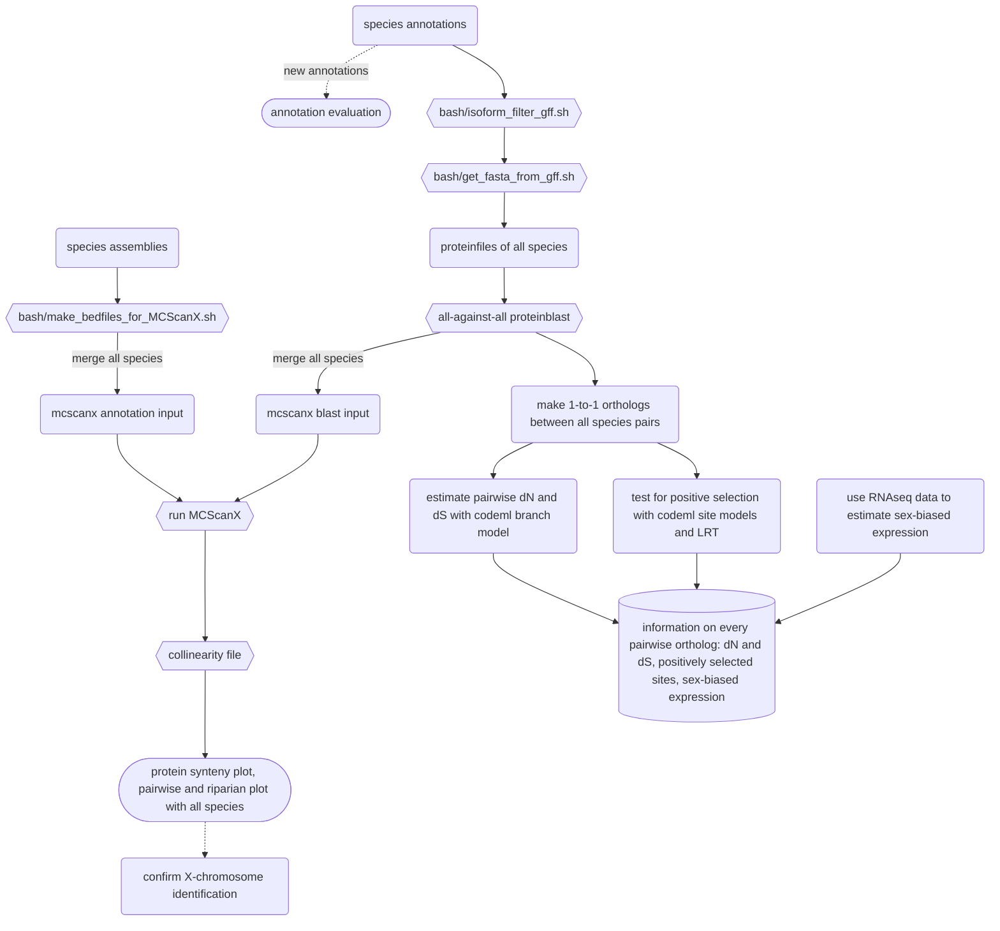
```mermaid
graph TD;
    species_Ass(species assemblies);
    species_Ass --> simplified_bed{{bash/make_bedfiles_for_MCScanX.sh}};
    simplified_bed -- merge all species --> mcscanx_bed(mcscanx annotation input);
    
    species_Ann(species annotations);
    species_Ann -. new annotations .-> BUSCO([annotation evaluation]);
    species_Ann --> is_filter{{bash/isoform_filter_gff.sh}};
    is_filter --> get_prot{{bash/get_fasta_from_gff.sh}};
    get_prot --> protfiles(proteinfiles of all species);
    protfiles --> blast{{all-against-all proteinblast}};
    blast -- merge all species --> mcscanx_blast(mcscanx blast input);

    mcscanx_bed --> run_mcscanx{{run MCScanX}};
    mcscanx_blast --> run_mcscanx
    run_mcscanx --> mcscanx_out{{collinearity file}}
    mcscanx_out --> mcscanx_plot([protein synteny plot, pairwise and riparian plot with all species])
    mcscanx_plot .-> conf_X(confirm X-chromosome identification)
    
    blast --> dNdS_groups(make 1-to-1 orthologs between all species pairs);

    dNdS_groups --> basicFastX(estimate pairwise dN and dS with codeml branch model);
    dNdS_groups --> posSel(test for positive selection with codeml site models and LRT);
    sexbias(use RNAseq data to estimate sex-biased expression)

    basicFastX --> summary[(information on every pairwise ortholog: dN and dS, positively selected sites, sex-biased expression)]
    posSel --> summary
    sexbias --> summary

```   

</details>

### Species selection

I want to look at groups of sister-species to take into account the evolutionary distance when comparing dN/dS ratio

* Include *Tribolium freemani* as a sister species to *T. castaneum* because of Whittle2020, T. freemani assembly [here](https://www.ebi.ac.uk/ena/browser/view/GCA_022388455.1)
  * no annotation available -> but RNAseq so I am annotating it myself from scratch
* include *Coccinella magnifica* (darwin tree of life project, [here](https://ftp.ncbi.nlm.nih.gov/genomes/all/GCA/965/644/565/GCA_965644565.1_icCocMagn1.hap1.1/)) as sister species to *Coccinella septempunctata*
  * no annotation available
  * Timetree says that they are "tne same species" so unclear what that means for their phylogenetic distance
* other *Chrysomelidae*
  * *D. virgifera virgifera* [here](https://www.ncbi.nlm.nih.gov/datasets/genome/GCF_917563875.1/) with no identified X chromosome
  * *Phyllotreata striolata* [here](https://www.ncbi.nlm.nih.gov/datasets/genome/GCA_918026865.1/) with no identified X chromosome
  * *Diabrotica undecimpunctata* [here](https://www.ncbi.nlm.nih.gov/datasets/genome/GCF_040954645.1/) with no identified X chromosome
  * *Diabrotica balteata* [here](https://www.ncbi.nlm.nih.gov/datasets/genome/GCA_918026665.1/) with no identified X chromosome
  * *Phaedon cochleariae* [here](https://www.ncbi.nlm.nih.gov/datasets/genome/GCA_918026855.4/) with no identified X chromosome
  * *Psylliodes chrysocephalus* [here](https://www.ncbi.nlm.nih.gov/datasets/genome/GCA_927349885.1/) (probably not this one? has a lot of chromosomes so identifying the X via synteny is not super viable) 
  * *Pseudozyma brasiliensis* [here](https://www.ebi.ac.uk/ena/browser/view/GCA_000497045.1?show=assembly-stats). 
    * no X identified
    * can't find an annotation, but in the associated [publication](https://journals.asm.org/doi/10.1128/genomea.00920-13#sec-1) it says that "*A total of 5,768 protein-encoding genes were identified, which is similar to the gene content of other Pseudozyma spp*", which seems weird? very few genes

I have annotated *T. freemani* with available RNAseq data from Whittle2020, but there was no RNAseq data for *C. septempunctata*. 

<details>
<summary>Annotation Evaluation</summary>

#### BUSCO scores

*C. maculatus* superscaffolded (adult LOME RNAseq but no larval), 19022 genes

```text
C:98.7%[S:72.2%,D:26.5%],F:0.6%,M:0.7%,n:1013	   
999	Complete BUSCOs (C)			   
731	Complete and single-copy BUSCOs (S)	   
268	Complete and duplicated BUSCOs (D)	   
6	Fragmented BUSCOs (F)			   
8	Missing BUSCOs (M)			   
1013	Total BUSCO groups searched
```

*C. magnifica* (no RNA available), 18978 genes

```text
C:96.0%[S:86.6%,D:9.4%],F:0.9%,M:3.1%,n:1013	   
972	Complete BUSCOs (C)			   
877	Complete and single-copy BUSCOs (S)	   
95	Complete and duplicated BUSCOs (D)	   
9	Fragmented BUSCOs (F)			   
32	Missing BUSCOs (M)			   
1013	Total BUSCO groups searched
```

*T. freemani* (includes RNAseq data), 18028 genes

```text
C:96.6%[S:88.5%,D:8.1%],F:1.4%,M:2.0%,n:1013	   
978	Complete BUSCOs (C)			   
896	Complete and single-copy BUSCOs (S)	   
82	Complete and duplicated BUSCOs (D)	   
14	Fragmented BUSCOs (F)			   
21	Missing BUSCOs (M)			   
1013	Total BUSCO groups searched
```

#### Single exon genes

<p float="left">
  
</p>

</details>

### sex chromosome identification

SATC R package (TODO cite): src/SATC_analysis_sex_chr_ident.Rmd

* **Bruchids**
  * *C. maculatus:* from Kaufmann et al.: 
    ```python
    { X : ['utg000057l_1','utg000114l_1','utg000139l_1','utg000191l_1','utg000326l_1','utg000359l_1','utg000532l_1','utg000602l_1'],
      Y : ['utg000322l_1','utg 000312c_1','utg 000610l_1','utg 001235l_1']}
    ## superscaffolded
    { X : ['scaffold_10','scaffold_14','scaffold_23','scaffold_31','scaffold_34','scaffold_83'],
      Y : ['scaffold_26','scaffold_48','scaffold_103','scaffold_112','scaffold_164']}
    ``` 
  
  * *C. chinensis:*
    identified by me, but the assembly is very fragmented so there is a lot of contigs.

    ```python
    { X : ["1211_quiver","1844_quiver","854_quiver","5741_quiver","2866_quiver","658_quiver","1498_quiver","1455_quiver","2404_quiver","2935_quiver","1115_quiver","370_quiver","2273_quiver","1424_quiver","1865_quiver","767_quiver","2222_quiver","1525_quiver","5023_quiver","1925_quiver","1217_quiver","2328_quiver","2475_quiver","959_quiver","537_quiver","2776_quiver","325_quiver","2576_quiver","2336_quiver","988_quiver","2252_quiver","1388_quiver","1508_quiver","1712_quiver","1260_quiver","977_quiver","2202_quiver","2223_quiver","2397_quiver","693_quiver","1092_quiver","2189_quiver","1958_quiver","1355_quiver","2241_quiver","849_quiver","703_quiver","277_quiver","518_quiver","2589_quiver","1326_quiver","2962_quiver","2341_quiver","358_quiver","462_quiver","2786_quiver","1116_quiver","525_quiver","1358_quiver","5693_quiver","1429_quiver","1253_quiver","2372_quiver","326_quiver","474_quiver","777_quiver","955_quiver","1852_quiver","718_quiver","1024_quiver","1974_quiver","2295_quiver","2356_quiver","1484_quiver","1503_quiver","3076_quiver","2091_quiver","1262_quiver","1109_quiver","1475_quiver","1695_quiver","1168_quiver","1386_quiver","2201_quiver","2320_quiver","1117_quiver","769_quiver","2050_quiver","1805_quiver","2692_quiver","411_quiver","851_quiver","5703_quiver","1585_quiver","824_quiver","1816_quiver","1370_quiver","2416_quiver","1814_quiver","1277_quiver","619_quiver","1750_quiver","2709_quiver","2664_quiver","1250_quiver","971_quiver","3020_quiver","310_quiver","1176_quiver","2510_quiver","1699_quiver","1256_quiver","1420_quiver","5727_quiver","413_quiver","1124_quiver","682_quiver","1000_quiver","1313_quiver","5708_quiver","1556_quiver","274_quiver","1787_quiver","1137_quiver","360_quiver","1469_quiver","1853_quiver","2380_quiver","1239_quiver","993_quiver","791_quiver","2540_quiver","1510_quiver","868_quiver","505_quiver","1212_quiver","376_quiver","1564_quiver","1836_quiver","1670_quiver","500_quiver","2099_quiver","353_quiver","1042_quiver","419_quiver","1314_quiver","1339_quiver","1470_quiver","1576_quiver","1717_quiver","5692_quiver","2157_quiver","700_quiver","1284_quiver","1694_quiver","2306_quiver","2712_quiver","182_quiver","1973_quiver","882_quiver","2363_quiver","2482_quiver","1640_quiver","1913_quiver","2323_quiver","1240_quiver","161_quiver","1649_quiver","1164_quiver","1054_quiver","1096_quiver","313_quiver","1815_quiver","1831_quiver","1349_quiver","151_quiver","1478_quiver","1523_quiver","1888_quiver","739_quiver","1322_quiver","2338_quiver","1798_quiver","1391_quiver","1530_quiver","1519_quiver","1651_quiver","1105_quiver","509_quiver","1308_quiver","1833_quiver","1914_quiver","1741_quiver","1080_quiver","2292_quiver","2364_quiver","643_quiver","5745_quiver","1920_quiver","1725_quiver","125_quiver","1086_quiver","2552_quiver","5749_quiver","2120_quiver","2964_quiver","5722_quiver","2045_quiver","2422_quiver","593_quiver","1496_quiver","1772_quiver","799_quiver","2690_quiver","414_quiver","1531_quiver","1443_quiver","1408_quiver","1688_quiver","1371_quiver","1501_quiver","3090_quiver","1025_quiver","5698_quiver","347_quiver","1435_quiver","476_quiver","1883_quiver","2820_quiver","5728_quiver","342_quiver","1972_quiver","1826_quiver","968_quiver","2037_quiver","1723_quiver","252_quiver","1863_quiver","2983_quiver","1947_quiver","1430_quiver","1612_quiver","1701_quiver","839_quiver","613_quiver","1979_quiver","1584_quiver","2024_quiver","1486_quiver","1097_quiver"],
      Y : ["850_quiver","949_quiver","1088_quiver","1125_quiver","1159_quiver","1134_quiver","1224_quiver","1369_quiver","1410_quiver","1568_quiver","1577_quiver","1619_quiver","1634_quiver","1646_quiver","1652_quiver","1665_quiver","1681_quiver","1697_quiver","1722_quiver","1766_quiver","1783_quiver","1891_quiver","1937_quiver","1963_quiver","1790_quiver","1997_quiver","2073_quiver","2113_quiver","2163_quiver","2166_quiver","5705_quiver","2245_quiver","2259_quiver","2260_quiver","2334_quiver","2340_quiver","2382_quiver","2443_quiver","2511_quiver","2534_quiver","2573_quiver","2597_quiver","2651_quiver","2707_quiver","2766_quiver","2773_quiver","2791_quiver","2830_quiver","2875_quiver","3022_quiver","3070_quiver","3074_quiver","3075_quiver","3078_quiver"]}
    ```
  * *B. siliquastri* identified by the DTOL project with the assembly
    ```python
    { X : ['X'],
      Y : ['Y']}
    ``` 
  * *A. obtectus* Identified by me and Göran's project about it
    ```python
    #### TODO double check these contig IDs
    { X : ["CAVLJG010000002.1","CAVLJG010003236.1","CAVLJG010003544.1","CAVLJG010000099.1","CAVLJG010000155.1","CAVLJG010000244.1","CAVLJG010000377.1","CAVLJG010000488.1",],
      Y : ["CAVLJG010000343.1","CAVLJG010002896.1","CAVLJG010000233.1","CAVLJG010000566.1","CAVLJG010000588.1",]}
    ``` 
    <details>
    <summary>A_obtectus chromosome name conversions</summary>
    The chromosome names in the ENA version of the assembly are weird, a whole header is like 
    ```
    >ENA_CAVLJG010000002_CAVLJG010000002.1 Acanthoscelides obtectus genome assembly, contig: chr_10
    >ENA_CAVLJG010002896_CAVLJG010002896.1 Acanthoscelides obtectus genome assembly, contig: scaffold_36
    ```
    and somehow in the mapping for the sex chromosome identification that Angela did, the contigs are identified as `chr_10` and `scaffold_36`, and not as `CAVLJG010000002.1`. This is confusing because in the original version of this assembly on uppmax after superscaffolding before it was deposited, the contigs are named like `HiC_scaffold_1`, and these scaffold numbers do *not* correspond to the ones in the ENA/NCBI headers! To be super clear I list below the complete X and Y association, which I need for further analyses because the annotation obviously uses `CAVLJG010000002.1` and not some weird tail end of the header.

    ```text
    X-contigs > 100 kb:
    * chr_10 :       CAVLJG010000002.1, 43142905 bp
    * scaffold_49 :  CAVLJG010003236.1, 333528 bp
    * scaffold_77 :  CAVLJG010003544.1, 217000 bp
    * scaffold_108 : CAVLJG010000099.1, 157500 bp
    * scaffold_113 : CAVLJG010000155.1, 147000 bp
    * scaffold_121 : CAVLJG010000244.1, 129500 bp
    * scaffold_133 : CAVLJG010000377.1, 114918 bp
    * scaffold_143 : CAVLJG010000488.1, 105500 bp

    Y-contigs > 100 kb:
    * scaffold_13 :  CAVLJG010000343.1, 1187000 bp
    * scaffold_36 :  CAVLJG010002896.1, 421500 bp
    * scaffold_120 : CAVLJG010000233.1, 131000 bp
    * scaffold_150 : CAVLJG010000566.1, 100909 bp
    * scaffold_152 : CAVLJG010000588.1, 100000 bp
    ```
    </details>


* **Diorhabada** 
  <details>
    <summary>not used in main analysis</summary>
  * [Diorhabda sublineata](https://www.ncbi.nlm.nih.gov/datasets/genome/GCF_026230105.1/)
  ```python
  { X : ['NC_079485.1'],
    Y : ['NC_079486.1']} 
  ``` 
  * [Diorhabda carinulata](https://www.ncbi.nlm.nih.gov/datasets/genome/GCF_026250575.1/)
  ```python
  { X : ['NC_079472.1'],
    Y : ['NC_079473.1']} 
  ``` 
  * There is also Diabrotica undecimpunctata but it does not have sex chromosomes identified, but it does have a giant genome at 1.7Gb
  </details>

* **Tribolium**
  * [Tribolium castaneum](https://www.ncbi.nlm.nih.gov/datasets/genome/GCF_031307605.1/)
  ```python
  { X : ['NC_087403.1'], # I think based on synteny, not identified on the NCBI
    Y : ['unidentified']}
  ```
  * [Tribolium freemani](https://www.ncbi.nlm.nih.gov/datasets/genome/GCA_022388455.1/)
  ```python
  { X : ['CM039461.1'], # identified as linkage group X (LGX) on the NCBI
    Y : ['unidentified']}
  ```

* **Coccinella**
  * [Coccinella septempunctata](https://www.ncbi.nlm.nih.gov/datasets/genome/GCF_907165205.1/)
  ```python
  { X : ['NC_058198.1'],
    Y : ['unidentified']}
  ```
  * [Coccinella magnifica](https://www.ncbi.nlm.nih.gov/datasets/genome/GCA_965644565.1/)
  ```python
  { X : ['OZ286750.1'],
    Y : ['unidentified']}
  ```


# Riparian plot for synteny TODO update for no *Diorhabda*

I use MCscanX to plot synteny, and [SynVisio](https://synvisio.github.io/) to visualize the riparian plot. *C. chinensis* is not superscaffolded and therefore not included in the plot.

<p float="left">
  
</p>

The X chromosomes are all shown at the right-most side of the plot except *D. carinulata*:
* ao1950 `CAVLJG010000002`
* bs9
* cm124 `utg000057l_1` (scaffold 10 in the superscaffolded version of Cmac)
* dc35 (!) (on the left in the plot)
* ds21

Synteny is conserved within *Bruchini* and within *Diorhabda*, but not between them.

Notably, there is one autosome missing in *A. obtectus*. Since the SynVisio website is not great to use with more species and when unplaced contigs are included, I use the setting to exclude contigs with no synteny blocks on them, which apparently excludes the one missing *A. obtectus* contig.

## X synteny in Tribolium and Coccinella

X chromosome names in the MCScanX synteny plots

* *T. castaneum*: NC_087403.1 = tc36
* *T. freemani*: CM039461.1 = tf4
* *C. magnifica*: OZ286750.1 = mc64 (mc instead of cm so that the initials are not the same as *C. maculatus*, which MCScanX can not handle)
* *C. septempunctata*: NC_058198.1 = cs7

<details>
<summary>synteny plot: T. castaneum and T. freemani</summary>
X chromosome on the bottom. tc36 and tf4

<p float="left">
  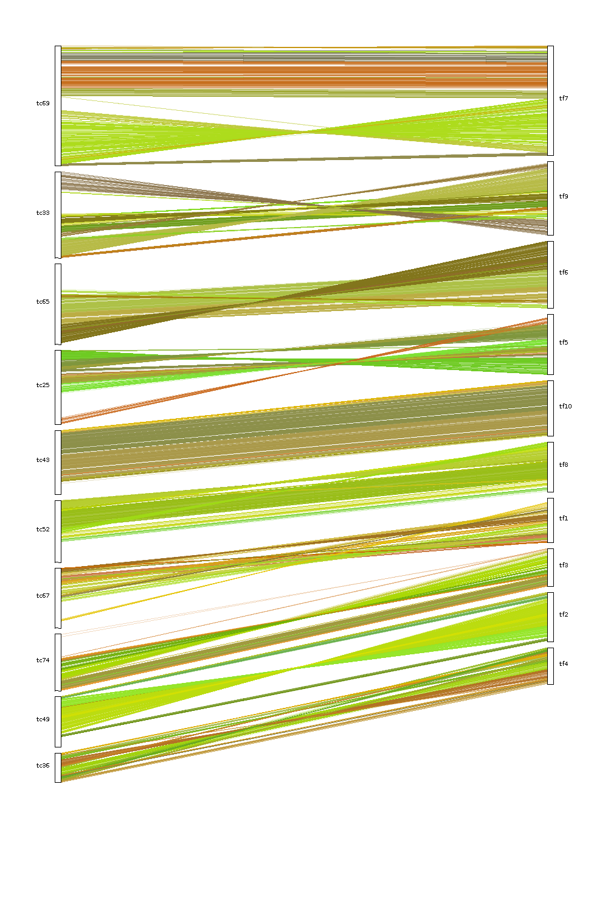
</p>

</details>

<details>
<summary>synteny plot: C. septempunctata and C. magnifica</summary>
X chromosome second to last, mc64 and cs7

<p float="left">
  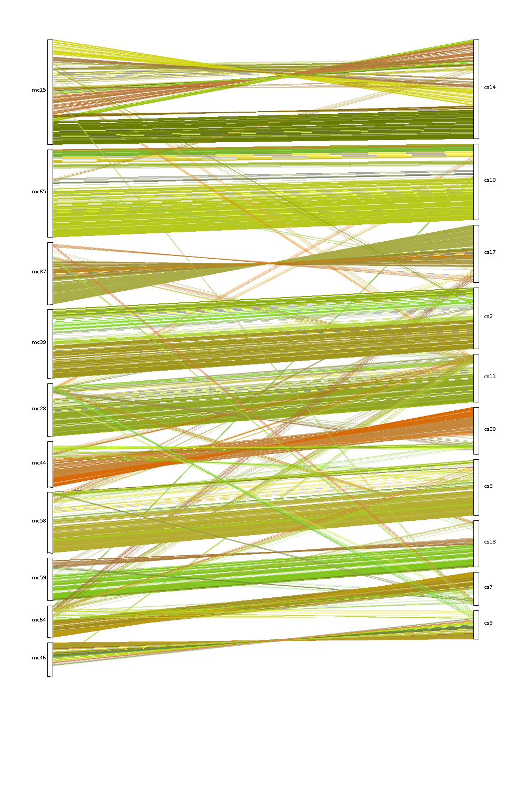
</p>

</details>


# ortholog identification

I will use the complete X contig list from the beginning, *not* just the syntenic contigs shown in the riparian plot.

## orthofinder

<details>
<summary>We decided to do BRH since it's only pairwise comparisons anyways, toggle down to see orthofinder upset plot though</summary>


In the original analysis with Lila we ran orthofinder and used the orthologs that are 1-to-1 across all species. With the new species selection, I tried that here as well, but it seems like the *Diorhabda* X chromosomes are not syntenic. 

<p float="left">
  
</p>

</details>

## best reciprocal hits

All comparisons of dNdS to identify fastX are always pairwise. Therefore it doesn't matter that a gene is 1-to-1 in all the species, only in the pair where i actually do the calculation. I will use the all-vs-all proteinblast that I made for the synteny with MCScanX (see chapter 2) to identify best reciprocal hits between pairs instead.

<p float="left">
  
  
</p>


I also check for gametologs (genes where there is a 1-to-1 homolog on the X and Y chromosome in the same species). the within-species gametolog counts are unfortunately very low:

* *A. obtectus* : 3
* *B. siliquastri* : 4
* *C. chinensis* : 1
* *C. maculatus* : 4
* *D. carinulata* : 3
* *D. sublineata* : 0

I suspect that this is not because there are no ancestral gametologs, but because there have been more recent duplications on X and/or Y. This would make them not 1-to-1 any more and therefore not identified in this test.

## Conclusion

I will continue with best reciprocal hits, becasue the orthofinder clustering is a bit more "relaxed", meaning that a transcript is more likely to be included in an orthogorup. Since I am only using pairwise comparisons, this method may make larger orthogroups that would not qualify as 1-to-1 orthologs, and therefore reduce the sample size for our dNdS analysis.

# paml codeml analysis

## dNdS: paml branch model

The paml branch model takes multiple sequence alignments and fits dNdS values to every branch. This approach worked when using MSAs of phylogeny-wide 1-to-1 orthologs, since those have more species in them. For the pairwise test we use now this is not a good approach because the "tree" here is only two species, which is not recommended. Therefore we decided to switch to site-models instead, see above. I keep these results here just in case I need them again for some reason.

### Statistical analysis via permutation test

The dNdS is calculated between all pairwise comparisons for A-linked and X-linked genes identified with BRH above. I am doing unique comparisons only below, so (Cmac,Aobt) is the same as (Aobt,Cmac) which is why only one of them is shown. Also, self-comparisons make no sense here so I am excluding them as well. I show horizontal lines of the median dNdS for A and X in matching colors to the violin plot to clearly show the mean difference in dNdS. I do the permutation test in four stebs like this:

1. **Sample without replacement:** Merge A and X value lists into one list, sample new A and new X lists with original sample sizes without replacement
2. **Calculate mean:** Calculate mean A and mean X from resampled lists, use difference A - X
3. **Normal distribution:** Compute a normal distribution from all mean(A) - mean(X) values, find 95% confidence intervals
4. **Plot:** Histrogram and normal distribution, compare original observed dNdS_A - dNdS_X to 95% confidence intervals of the permutations

Additionally, all plots are filtered to only contain dNdS ratios where the dS < 2.

The right is all the permutation tests. the pink line is the measured `dNdS_A - dNdS_X`, while green is the distributions from the permutation test. Since I am plotting `dNdS_A - dNdS_X`, and I mostly observe `dNdS_A - dNdS_X > 0`, which means `dNdS_A > dNdS_X`, this indicates slowX. 

<p float="center">
  
</p>

<p float="left">
  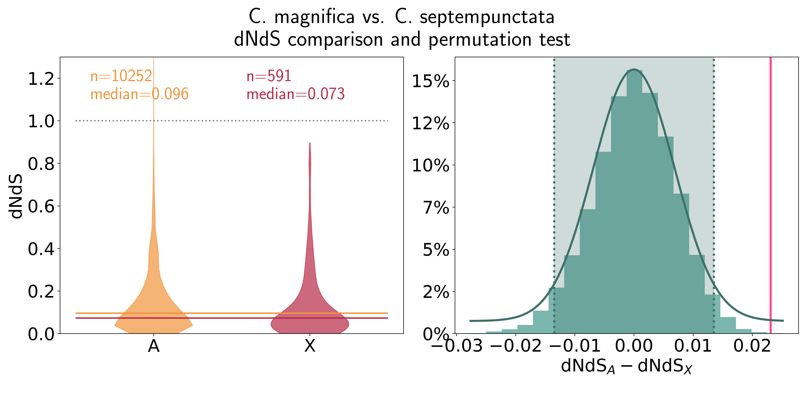
  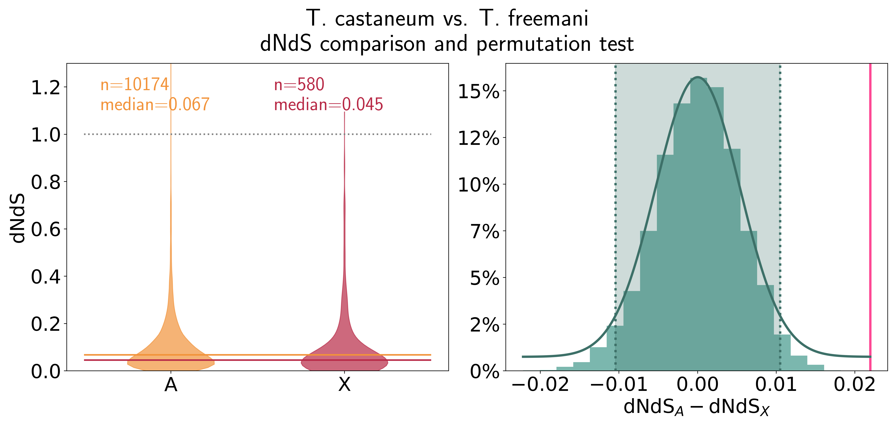
</p>

## dS: phylogenetic distances

In many cases, orthologs are too diverged to properly estimate dS, which greatly impacts the dNdS ratio. I therefore also look at dN and dS separately to assess the reliability of the estimates, and also to see if there is a difference in neutral substitution rate between X and A. (not shown here: very distant comparisons such as between the groups results in a saturation of dS values, where the estimation in paml breaks down and many values are estimated to 3. Therefore I have decided to only do within-group comparisons and filter both dS and dNdS to <2.

<p float="center">
  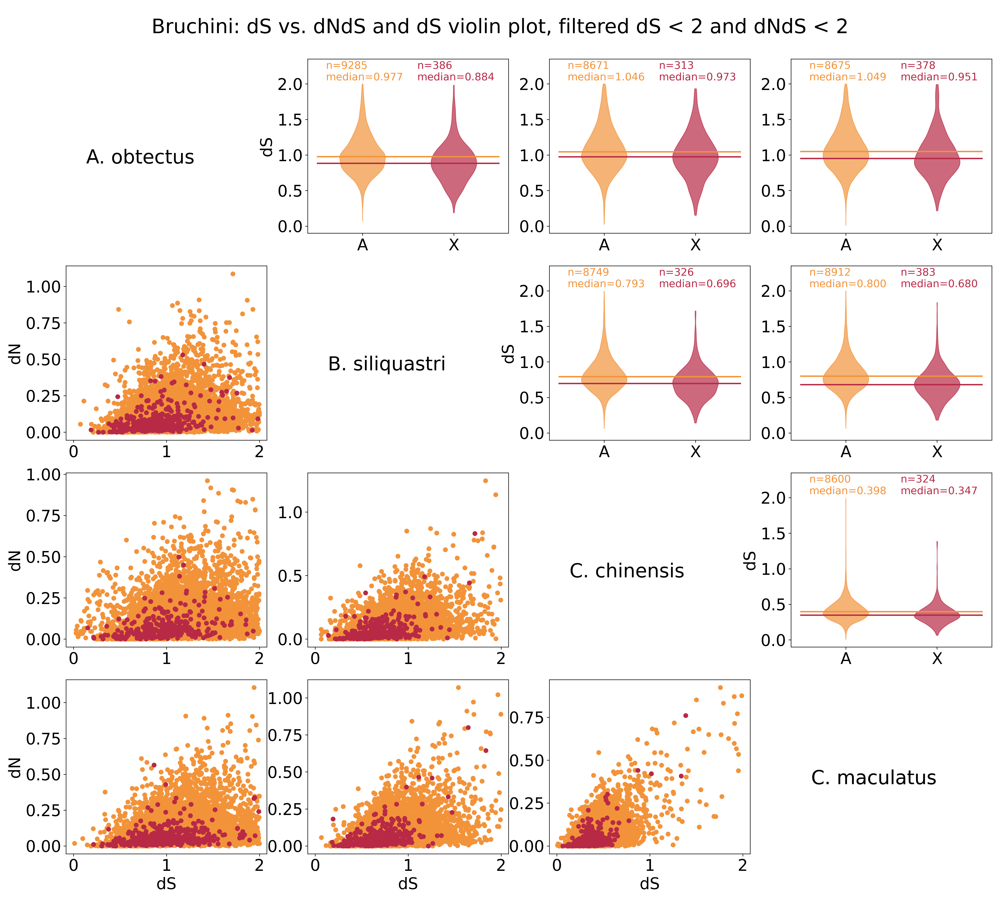
</p>

<p float="left">
  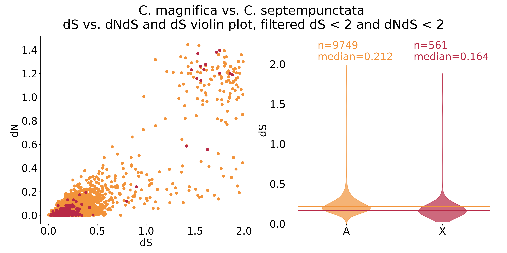
  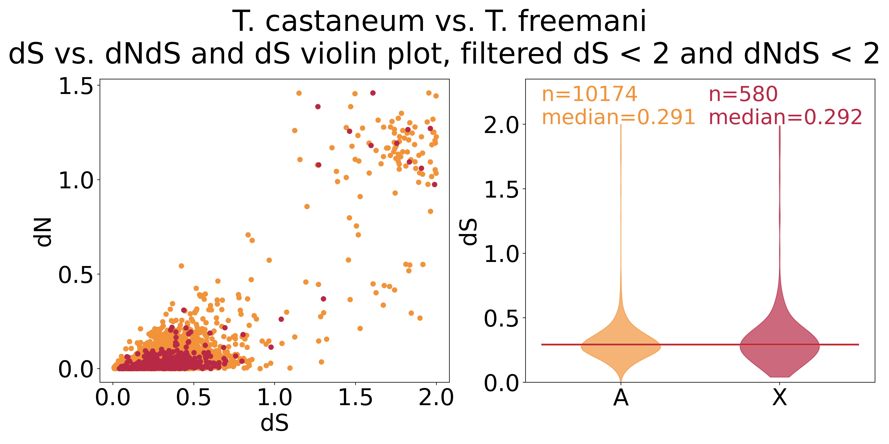
</p>

Overall, the dS is lower on X in all cases, and since dS is assumed to be neutral, this is likely an effect of the average lower mutation rate on X compared to A (due to the elevated mutation rate in the male germline). I have run the same permutation test as for the dNdS analysis, it's just not plotted here. All pairs show significant differences except *Tribolium*.

***Bruchini***
```text
A_obtectus_C_maculatus --> 	   median(dNdS_A)-median(dNdS_X) = 0.098, mean bootstrap diff =  0.00014 with CI [-0.03081,0.03110] --> SIGNIFICANT
C_chinensis_C_maculatus --> 	 median(dNdS_A)-median(dNdS_X) = 0.050, mean bootstrap diff =  0.00019 with CI [-0.01798,0.01836] --> SIGNIFICANT
B_siliquastri_C_maculatus -->  median(dNdS_A)-median(dNdS_X) = 0.120, mean bootstrap diff =  0.00004 with CI [-0.02476,0.02484] --> SIGNIFICANT
A_obtectus_C_chinensis --> 	   median(dNdS_A)-median(dNdS_X) = 0.072, mean bootstrap diff =  0.00009 with CI [-0.03635,0.03653] --> SIGNIFICANT
A_obtectus_B_siliquastri --> 	 median(dNdS_A)-median(dNdS_X) = 0.093, mean bootstrap diff = -0.00010 with CI [-0.02889,0.02868] --> SIGNIFICANT
B_siliquastri_C_chinensis -->  median(dNdS_A)-median(dNdS_X) = 0.097, mean bootstrap diff = -0.00001 with CI [-0.02696,0.02695] --> SIGNIFICANT
```

***Coccinella* and *Tribolium***

```text
C_magnifica_C_septempunctata --> 	 median(dNdS_A)-median(dNdS_X) = 0.048, mean bootstrap diff = -0.00007 with CI [-0.01728,0.01715] --> SIGNIFICANT
T_castaneum_T_freemani --> 	       median(dNdS_A)-median(dNdS_X) = -0.002, mean bootstrap diff = 0.00002 with CI [-0.01600,0.01603] --> (nonsignificant)
```


It is also noteable that the dS scatter is mostly constrained to <1 in closely related sister species (*Callosobruchus*, *Tribolium*, *Coccinella*), and increases closer to 2 in more distant comparisons in the bruchids (*C. maculatus* vs. *B. siliquastri* and *C. maculatus* vs. *A. obtectus*). I implemented an option to calculate a linear regression slope of the dS/dN scatterplots, but there does not seem to be consistend ot meaningful differences in slope between X and A, and this may not be the most reliable analysis anyways since the independence of dS and dN is not quite clear to me.

## paml site models and LRT

I have decided to go with the paml site model, since I am only doing a pairwise comparison, and the branch model is not reliable for a tree of only two species. I compute M1a and M2a models (nearly neutral and positive selection respectively, see paml documentation), do the likelihood ratio test, and then return the site-class table of M2a if the test is significant, and M1a if it is not. This can then be used to either compute an average dNdS for the entire gene (weighted by proportions) or to do some other independent statistical analysis based on the proportion of positively selected sites in A vs. X genes. I use two degrees of freedom for the LRT as specified in the paml documentation.

### w values from site classes

I use as an example here a gene under positive selection: Dcar_Dsub ortholog no. 0.

```text 
p:   0.93938  0.00000  0.06061
w:   0.04346  1.00000 27.41259
```
when I use `p` as weights, the weighted average w is 0.0437239804. Accodring to the `dN & dS for each branch` table, the dNdS is  1.7024, but even with the normal, non-weighted mean I only get 0.33893, so no clue what is happening here. Since I specify a site model and not a branch model, I will ignore this. Additionally, 27.4 seems crazy high for w, and there's much higher ones than that in some other genes, so I would not be using the actual numerical value, but rather the proportion, which is 0 if the LRT is not significant.

## Results

### multiple testing correction

The LRT is an individual significance test with a p-value for each ortholog. I do Benjamini-Hochberg correction on all X and all A-linked orthologs.
* **X-linked**
	 * 2764 genes not under positive selection
	 * 463 are under positive selection after BH correction
	 * 159 were positively selected according to simple p-value but are not any more after BH correction
* **A-linked**
	 * 63559 genes not under positive selection
	 * 7820 are under positive selection after BH correction
	 * 4686 were positively selected according to simple p-value but are not any more after BH correction

### plots

I categorize genes according to whether the LRT was significant or not and base the statistical analysis on that, and do the permutation test as described above

Everything is 10000 permutations, and A-X, therefore:
 
* A-X < 0 -> A < X -> FastX
* A-X > 0 -> A > X -> SlowX

* *Bruchini*: FastX in all comparisons
* *Coccinella* and *Tribolium*: not significant

<p float="center">
  
</p>

<p float="left">
  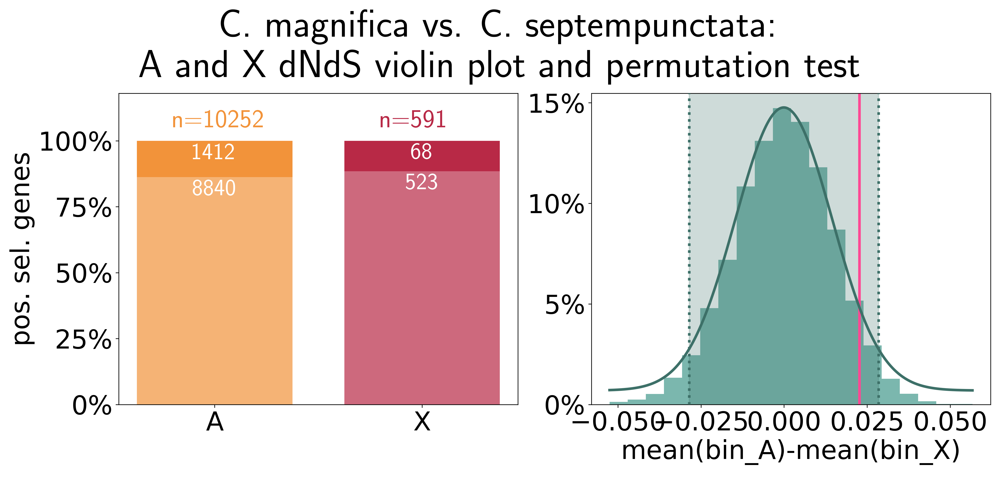
  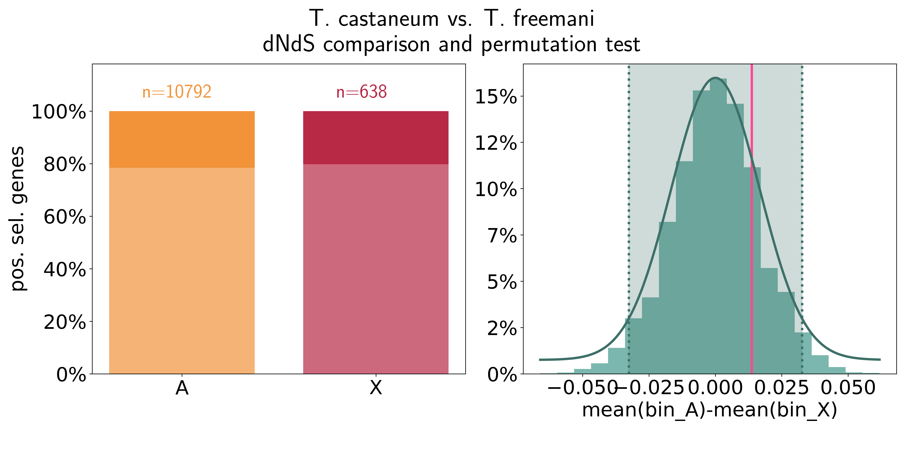
</p>

### Summary

Methods similar to [Torgerson & Singh 2006](https://www.nature.com/articles/6800749)), which shows Faster X in sperm-expressed genes in mammals. This is a much smaller dataset and they only have one comparison. They have two approaches for analysis:

* **binary**: which I also do. They find fastX for non-sperm expressed genes
* **proportional**: they count the codons according to the BEB (bayes empirical bayes) test and don't use the site classes proportion. I'm unsure how exactly that works because they show the proportion of positively selected codons but it's possible for two orthologs to have different lengths? 
  * Maybe I can count the number of codons and normalize by the number of genes instead?

[Whittle 2020](https://academic.oup.com/g3journal/article/10/3/1125/6026234) already did this comparison, and they find significantly slow X. But they do paml `yn00` which we have concluded is not ideal.


# Sex biased gene expression

## Samples and PCA

As a bunch of papers in the literature review above have found, the molecular rate of X-linked genes can differ depending on their expression sex-bias (since that can strengthen or weaken the impact of the dominance and heterozygosity effects that influence faster or slower X). I have found three sets of RNAseq data, one in each species group, to assess sex bias in the orthologs and evaluate this. The RNAseq data is from *T. castaneum*, *C. septempunctata* and *C. maculatus*. I mostly follow the standard STAR pipeline from [Sebastian's github](https://github.com/sellwe/Master_thesis_sebastian) (without taking into account multimapping) to get the read counts, and then use edgeR in R to normalize counts.

### *C. maculatus*

The dataset includes virgin and mated individuals, I am only using virgin.

<p float="left">
  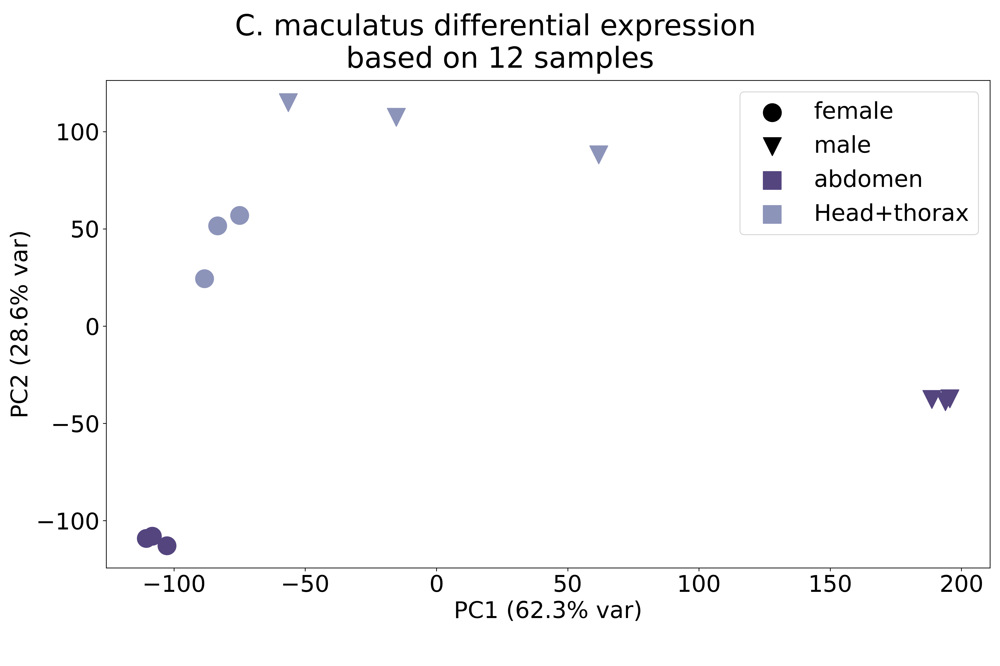
</p>

Sex biased expression is the main PC, tissue differences only 2nd PC with much less variance explained. Can probably use all samples for sex bias.

<details>
  <summary>DE for Coccinella and Tribolium</summary>

There is also data for the other species but the sampling is not great and so we're not using it 

### *C. septempunctata*

<p float="left">
  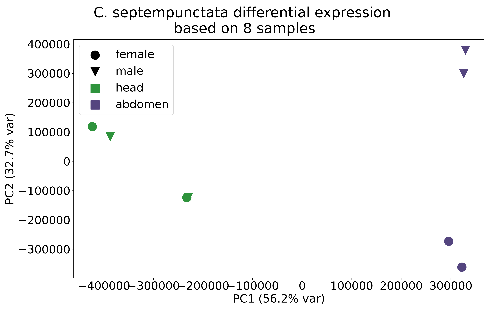
</p>

PC1 is the tissue, and clear sex bias is only present in the abdomen. Only use abdomen for sex biased expression? 

### *T. castaneum*

<p float="left">
  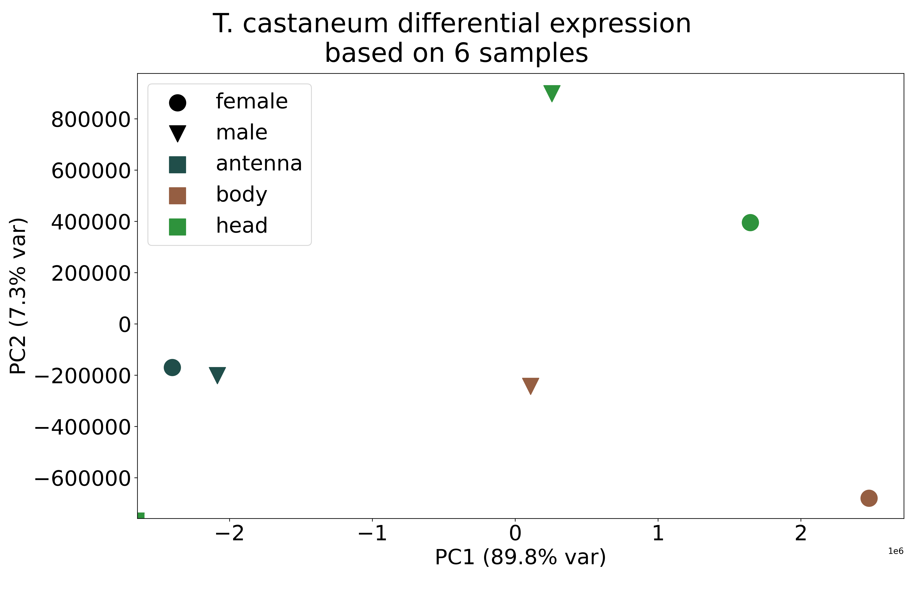
</p>

PC1 shows sex bias only in head and body, not antennae. Exclude antennae from sex biased expression?

</details>


## Differential expression analysis with edgeR

I had a bad time with DESeq2, and I will be using edgeR. The main point is to do the preprocessing (normalizing etc.) and then to do a differential expression analysis of sex bias in abdomen and head+thorax samples. I am using Elina's code from the original publication, and I am saving output tables of normalized counts, LFC abdomen and LFC head+thorax for all genes. The results for the differential expression is very similar even though the reads were mapped to the genome of a different population

<p float="left">
  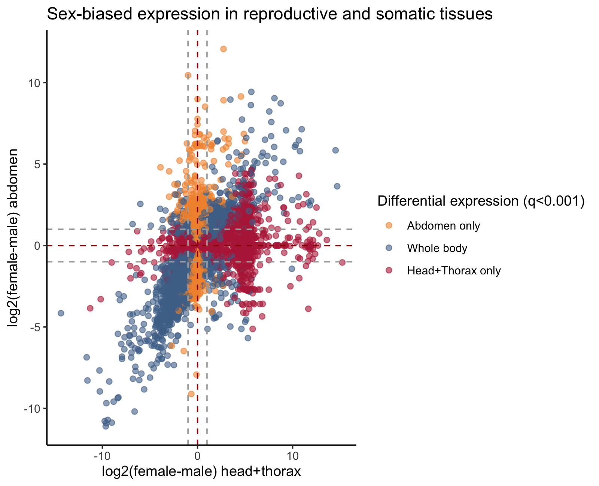
</p>

number of sex-biased genes in female-male contrast according to R:

```r
# abdomen
lrt_a <- glmLRT(fit, contrast=my.contrasts[,"Sex_a"])
summary(de<-decideTestsDGE(lrt_a, p.value=0.05, lfc=1))
# head+thorax
lrt_h <- glmLRT(fit, contrast=my.contrasts[,"Sex_h"])
summary(de<-decideTestsDGE(lrt_h, p.value=0.05, lfc=1))
```

|               | abdomen       | head+thorax   | sex bias      |
| ------------- | ------------- | ------------- | ------------- |
| downregulated | 3265          | 1331          | male-biased   |
| unbiased      | 5279          | 9201          |               |
| upregulated   | 2793          | 805           | female-biased |


I have exported the results of this analysis into a table using `topTags()` with the log2FC, BH-corrected p-value (same correction method as `decideTestsDGE()`) and gene ID.

```r
SexbAbd <- topTags(lrt_a, n=Inf)
SexbHT <- topTags(lrt_h, n=Inf)
```

numbers split by X and A in python are identical to the ones from R:

```text
** sig_female (upregulated)
	abdomen A+X     -->		2681 + 112 = 2793
	head_thorax A+X --> 	784 + 21 = 805
** unbiased (unbiased)
	abdomen A+X     -->		5031 + 248 = 5279
	head_thorax A+X --> 	8812 + 389 = 9201
** sig_male (downregulated)
	abdomen A+X     -->		3186 + 79 = 3265
	head_thorax A+X -->	  1302 + 29 = 1331
```

<p float="left">
  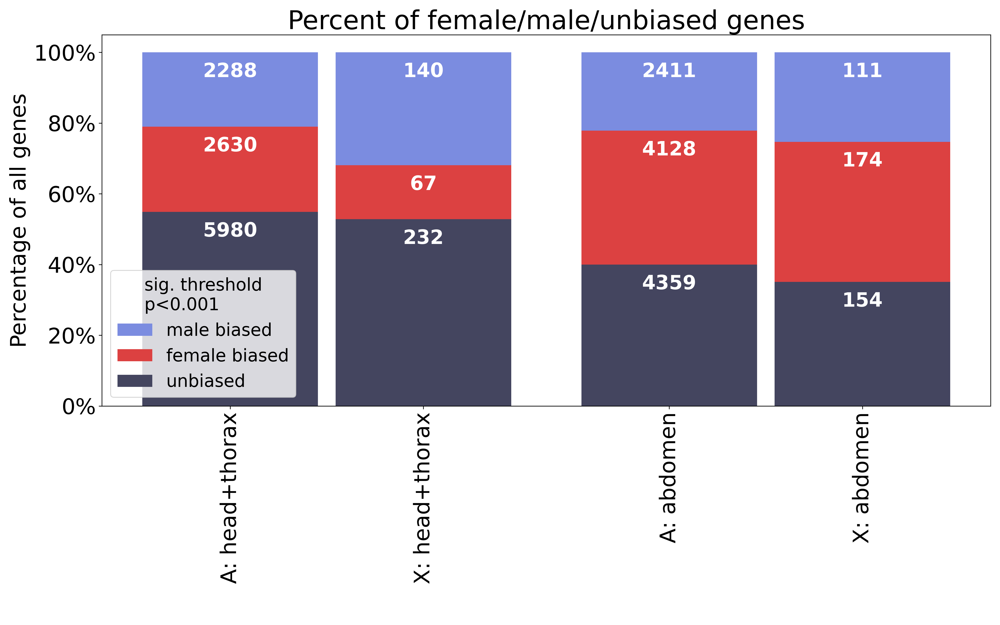
</p>


### Dosage compensation

Theoretically, dosage compensation should be weaker in the abdominal tissues since that is where the reproductive organs are (which are not dosage compensated), which would show as stronger female-bias on the X in abdominal tissues than head+thorax. I have plotted the log2FC of X-linked genes in C. maculatus along the X-chromosomal position:

<p float="left">
  
</p>

I calculated the standard error of the mean (SEM) with `scipy.stats.sem` which takes sample size into account.

* scaffold_10 : 300 transcripts
	 * abdomen mean log2FC: 0.043, SEM: 0.099
	 * head+thorax mean log2FC: -0.258, SEM: 0.097
* scaffold_14 : 67 transcripts
	 * abdomen mean log2FC: -0.001, SEM: 0.221
	 * head+thorax mean log2FC: -0.317, SEM: 0.186
* scaffold_23 : 4 transcripts
	 * abdomen mean log2FC: 2.043, SEM: 2.472
	 * head+thorax mean log2FC: 0.450, SEM: 1.476
* scaffold_31 : 22 transcripts
	 * abdomen mean log2FC: 0.222, SEM: 0.665
	 * head+thorax mean log2FC: -0.466, SEM: 0.302
* scaffold_34 : 44 transcripts
	 * abdomen mean log2FC: 0.125, SEM: 0.218
	 * head+thorax mean log2FC: -0.247, SEM: 0.246
* scaffold_83 : 2 transcripts
	 * abdomen mean log2FC: -0.910, SEM: 1.759
	 * head+thorax mean log2FC: 4.023, SEM: 1.668


## sex bias and ortholog conservation


I have assigned each Cmac ortholog a "conservation rank" depending on the most distant species in which there is a 1-to-1 ortholog for this gene. Most genes are highly conserved with orthologs all the way in *D. melanogaster*. The ranks are these: 

```python 
ranks_dict = {
        "D_melanogaster" : 5,
        "T_castaneum" : 4, "T_freemani" : 4,"C_magnifica" : 4,"C_septempunctata" : 4,
        "A_obtectus" : 3,
        "B_siliquastri" : 2,
        "C_chinensis" : 1,
    }
```

We expect X-linked genes to be more dosage compensated the more conserved they are, because dosage compensation has had more time to evolve. We see the opposite trend, with sex bias decreasing for increasing conservation rank. Also, it kind of looks like there is a trend downwards in female-bias for A/X and both tissues, but with the large difference in sample size it is difficult to tell.

### 1. sex bias categories

<p float="left">
  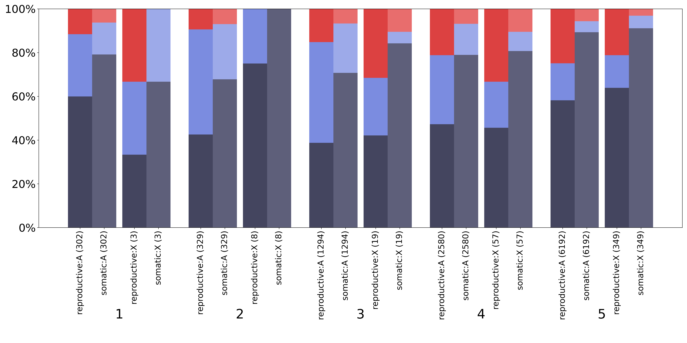
</p>

#### ordinal logistic regression

explanatory variables are chromosome type, conservation rank, and their interaction. Response variables are the sex-biased expression categories (-1=male, 0=unbiased, 1=female). Unsure how to interpret this now check tomorrow. seems everything is significant??

```text
////////////////// ABDOMEN //////////////////
                                 OrderedModel Results                                
=====================================================================================
Dep. Variable:     abdomen_sex_bias_category   Log-Likelihood:                -11096.
Model:                          OrderedModel   AIC:                         2.220e+04
Method:                   Maximum Likelihood   BIC:                         2.224e+04
Date:                       Thu, 19 Feb 2026                                         
Time:                               17:38:04                                         
No. Observations:                      11133                                         
Df Residuals:                          11128                                         
Df Model:                                  3                                         
=====================================================================================
                        coef    std err          z      P>|z|      [0.025      0.975]
-------------------------------------------------------------------------------------
interaction          -0.3214      0.133     -2.413      0.016      -0.582      -0.060
conservation_rank     0.3848      0.019     20.046      0.000       0.347       0.422
chromosome            1.6375      0.635      2.581      0.010       0.394       2.881
-1/0                  0.5421      0.084      6.461      0.000       0.378       0.707
0/1                   0.8919      0.011     79.196      0.000       0.870       0.914
=====================================================================================

////////////////// HEAD+THORAX //////////////////
                                   OrderedModel Results                                  
=========================================================================================
Dep. Variable:     head_thorax_sex_bias_category   Log-Likelihood:                -6015.0
Model:                              OrderedModel   AIC:                         1.204e+04
Method:                       Maximum Likelihood   BIC:                         1.208e+04
Date:                           Thu, 19 Feb 2026                                         
Time:                                   17:38:04                                         
No. Observations:                          11133                                         
Df Residuals:                              11128                                         
Df Model:                                      3                                         
=====================================================================================
                        coef    std err          z      P>|z|      [0.025      0.975]
-------------------------------------------------------------------------------------
interaction          -0.4102      0.192     -2.132      0.033      -0.787      -0.033
conservation_rank     0.3654      0.025     14.515      0.000       0.316       0.415
chromosome            1.9447      0.915      2.126      0.034       0.152       3.738
-1/0                 -0.6507      0.107     -6.098      0.000      -0.860      -0.442
0/1                   1.6149      0.010    160.773      0.000       1.595       1.635
=====================================================================================
```

All exp. variables and their interaction are significant.

### 2. magnitude of sex bias

When only looking at the expression of significantly sex biased genes we can see that the magnitude of sex bias decreases with age.

<p float="left">
  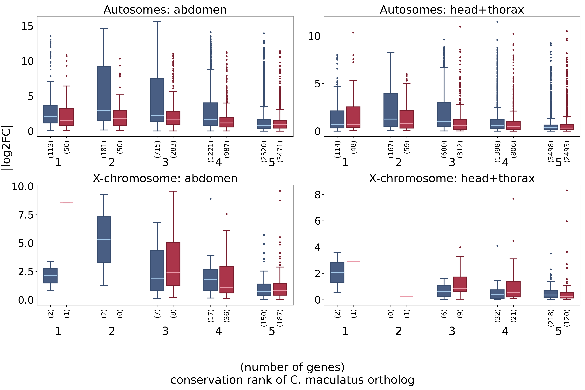
</p>


#### median quantile expression test

I specified the model like `LFC ~ level_most_dist_ortholog * C(chromosome)` with one model for abdomen LFC and one for head+thorax, where chromosome is a categorical variable, and level_most_dist_ortholog is treated as discrete numerical. I test male and female bias seperately, and it is always absolute Log2FC values, so that the male value is positive as well. The model was run using `statsmodels.formula.api.quantreg()`.

Mind that the tests are split differently than the plot above! the tests are tissue x sex-bias, and the plot is tissue x chromosome!

```text
////////////////// ABDOMEN -- FEMALE-BIASED //////////////////
===============================================================================================================
                                                  coef    std err          t      P>|t|      [0.025      0.975]
---------------------------------------------------------------------------------------------------------------
Intercept                                       2.2544      0.096     23.546      0.000       2.067       2.442
C(chromosome)[T.1]                              2.5838      0.607      4.256      0.000       1.394       3.774
level_most_dist_ortholog                       -0.2723      0.021    -13.268      0.000      -0.313      -0.232
level_most_dist_ortholog:C(chromosome)[T.1]    -0.5404      0.127     -4.261      0.000      -0.789      -0.292
===============================================================================================================

////////////////// ABDOMEN -- MALE-BIASED //////////////////
===============================================================================================================
                                                  coef    std err          t      P>|t|      [0.025      0.975]
---------------------------------------------------------------------------------------------------------------
Intercept                                       4.0283      0.092     43.919      0.000       3.848       4.208
C(chromosome)[T.1]                             -0.0035      0.766     -0.005      0.996      -1.504       1.497
level_most_dist_ortholog                       -0.6368      0.021    -30.190      0.000      -0.678      -0.595
level_most_dist_ortholog:C(chromosome)[T.1]    -0.0183      0.160     -0.114      0.909      -0.332       0.295
===============================================================================================================
```
The trend in expression change is significant for the conservation rank, it decreases with age. in Female-biased genes there is also a significant difference between X-linked and autosomal genes, as well as their interaction with conservation rank. In male-biased genes the chromosome linkage does not make a difference for the expression change with conservation level.

```text
////////////////// HEAD+THORAX -- FEMALE-BIASED //////////////////
===============================================================================================================
                                                  coef    std err          t      P>|t|      [0.025      0.975]
---------------------------------------------------------------------------------------------------------------
Intercept                                       0.9944      0.046     21.656      0.000       0.904       1.084
C(chromosome)[T.1]                              0.8333      0.290      2.870      0.004       0.264       1.403
level_most_dist_ortholog                       -0.1348      0.010    -13.473      0.000      -0.154      -0.115
level_most_dist_ortholog:C(chromosome)[T.1]    -0.1867      0.061     -3.049      0.002      -0.307      -0.067
===============================================================================================================

////////////////// HEAD+THORAX -- MALE-BIASED //////////////////
===============================================================================================================
                                                  coef    std err          t      P>|t|      [0.025      0.975]
---------------------------------------------------------------------------------------------------------------
Intercept                                       1.5451      0.033     46.318      0.000       1.480       1.610
C(chromosome)[T.1]                             -0.7290      0.294     -2.477      0.013      -1.306      -0.152
level_most_dist_ortholog                       -0.2395      0.007    -32.045      0.000      -0.254      -0.225
level_most_dist_ortholog:C(chromosome)[T.1]     0.1481      0.061      2.428      0.015       0.029       0.268
===============================================================================================================
```
All significant: expression depends on both X or A-linkage as well as conservation rank and their interaction. mind the missing data and low sample size esp. for X-linked genes though, see plot.


## combining sex-biased expression with molecular rate and positive selection

I am incorporating sex-bias so that i look at absolute logFC and then add a separate fixed factor of male- or female bias, so that I can look at the magnitude and direction of sex-bias separately. I am using the [Wald test](https://www.statology.org/wald-test-python/) to see if some explanatory variables or interactions are insignificant (p>0.05) and then exclude these, I present only the results for the simplest model below. This always starts from the formula `dNdS ~ (LFC_abdomen + LFC_head_thorax + C(SB_abdomen) + C(SB_head_thorax)) * C(chromosome) * level_most_dist_ortholog` but I present the simpler formula I land for each model seperately below.

### median quantile dN/dS test

I am using `quantreg` again, like for the log2FC again, where i have a continuous response variable. All three-way interactions can be dropped according to the Wald-test, as well as two-way interactions between anything involving expression and the chromosome type (A or X), while two-way interactions between expression and conservation rank are significant and stay. this is the formula: `dNdS ~ (LFC_abdomen + LFC_head_thorax + C(SB_abdomen) + C(SB_head_thorax)) + C(chromosome) + level_most_dist_ortholog + (LFC_abdomen + LFC_head_thorax + C(SB_abdomen) + C(SB_head_thorax)) : level_most_dist_ortholog`

Conclusions, results are surprisingly variable between species pairs:

* Chromosome type major effect: nonsignificant in *C. chinensis*, but significant (with neg. coeff which means X has lower dNdS) in *B. siliquastri* and *A. obtectus*
* both LFC tissues are significant major effects in *B. siliquastri* and *A. obtectus*, but only abdominal LFC is significant in *C. chinensis*.
* the sex bias direction for both tissues is significant in *C. chinensis*, but only head+thorax in *B. siliquastri* and *A. obtectus* (always neg. coeff -> male-bias causes lower dNdS)
* conservation rank is highly significant in all cases
* interactions
  * *C. chinensis*: `C(SB_abdomen)[T.male]:level_most_dist_ortholog` 
  * *B. siliquastri*: `C(SB_head_thorax)[T.male]:level_most_dist_ortholog` and `LFC_abdomen:level_most_dist_ortholog` and `LFC_head_thorax:level_most_dist_ortholog` (which exclude the one significant in *C. chinensis*)
  * *A. obtectus*: same as *B. siliquastri* with coefficients in the same direction

```test
////////////////// C_chinensis //////////////////
======================================================================================================================
                                                         coef    std err          t      P>|t|      [0.025      0.975]
----------------------------------------------------------------------------------------------------------------------
Intercept                                              0.2729      0.010     26.304      0.000       0.253       0.293
C(SB_abdomen)[T.male]                                 -0.0330      0.013     -2.524      0.012      -0.059      -0.007
C(SB_head_thorax)[T.male]                             -0.0345      0.013     -2.627      0.009      -0.060      -0.009
C(chromosome)[T.X]                                    -0.0017      0.005     -0.346      0.730      -0.012       0.008
LFC_abdomen                                            0.0078      0.003      2.869      0.004       0.002       0.013
LFC_head_thorax                                        0.0017      0.005      0.372      0.710      -0.007       0.011
level_most_dist_ortholog                              -0.0421      0.002    -18.805      0.000      -0.046      -0.038
C(SB_abdomen)[T.male]:level_most_dist_ortholog         0.0062      0.003      2.207      0.027       0.001       0.012
C(SB_head_thorax)[T.male]:level_most_dist_ortholog     0.0052      0.003      1.840      0.066      -0.000       0.011
LFC_abdomen:level_most_dist_ortholog                  -0.0010      0.001     -1.515      0.130      -0.002       0.000
LFC_head_thorax:level_most_dist_ortholog               0.0007      0.001      0.583      0.560      -0.002       0.003
======================================================================================================================

////////////////// B_siliquastri //////////////////
======================================================================================================================
                                                         coef    std err          t      P>|t|      [0.025      0.975]
----------------------------------------------------------------------------------------------------------------------
Intercept                                              0.2927      0.009     32.369      0.000       0.275       0.310
C(SB_abdomen)[T.male]                                  0.0027      0.012      0.224      0.823      -0.021       0.026
C(SB_head_thorax)[T.male]                             -0.0851      0.012     -7.186      0.000      -0.108      -0.062
C(chromosome)[T.X]                                    -0.0128      0.004     -3.389      0.001      -0.020      -0.005
LFC_abdomen                                            0.0099      0.002      4.459      0.000       0.006       0.014
LFC_head_thorax                                       -0.0143      0.004     -3.620      0.000      -0.022      -0.007
level_most_dist_ortholog                              -0.0457      0.002    -23.523      0.000      -0.050      -0.042
C(SB_abdomen)[T.male]:level_most_dist_ortholog        -0.0012      0.003     -0.466      0.641      -0.006       0.004
C(SB_head_thorax)[T.male]:level_most_dist_ortholog     0.0160      0.003      6.299      0.000       0.011       0.021
LFC_abdomen:level_most_dist_ortholog                  -0.0020      0.001     -3.739      0.000      -0.003      -0.001
LFC_head_thorax:level_most_dist_ortholog               0.0040      0.001      4.098      0.000       0.002       0.006
======================================================================================================================

////////////////// A_obtectus //////////////////
======================================================================================================================
                                                         coef    std err          t      P>|t|      [0.025      0.975]
----------------------------------------------------------------------------------------------------------------------
Intercept                                              0.2830      0.009     32.159      0.000       0.266       0.300
C(SB_abdomen)[T.male]                                  0.0085      0.012      0.720      0.471      -0.015       0.032
C(SB_head_thorax)[T.male]                             -0.0824      0.012     -7.041      0.000      -0.105      -0.059
C(chromosome)[T.X]                                    -0.0105      0.003     -3.102      0.002      -0.017      -0.004
LFC_abdomen                                            0.0089      0.003      3.430      0.001       0.004       0.014
LFC_head_thorax                                       -0.0101      0.005     -2.211      0.027      -0.019      -0.001
level_most_dist_ortholog                              -0.0453      0.002    -23.904      0.000      -0.049      -0.042
C(SB_abdomen)[T.male]:level_most_dist_ortholog        -0.0025      0.003     -1.010      0.313      -0.007       0.002
C(SB_head_thorax)[T.male]:level_most_dist_ortholog     0.0156      0.003      6.241      0.000       0.011       0.021
LFC_abdomen:level_most_dist_ortholog                  -0.0015      0.001     -2.461      0.014      -0.003      -0.000
LFC_head_thorax:level_most_dist_ortholog               0.0028      0.001      2.501      0.012       0.001       0.005
======================================================================================================================
```


### plots

#### dN/dS by chromosome and conservation rank

green is A and violet is X. Also keep in mind that the conservation rank is 1:C_chinensis and 2:B_siliquastri, so the lowest possible rank for *A. obtectus* is 3.

This seems mostly in line with statistical results. 

<p float="left">
  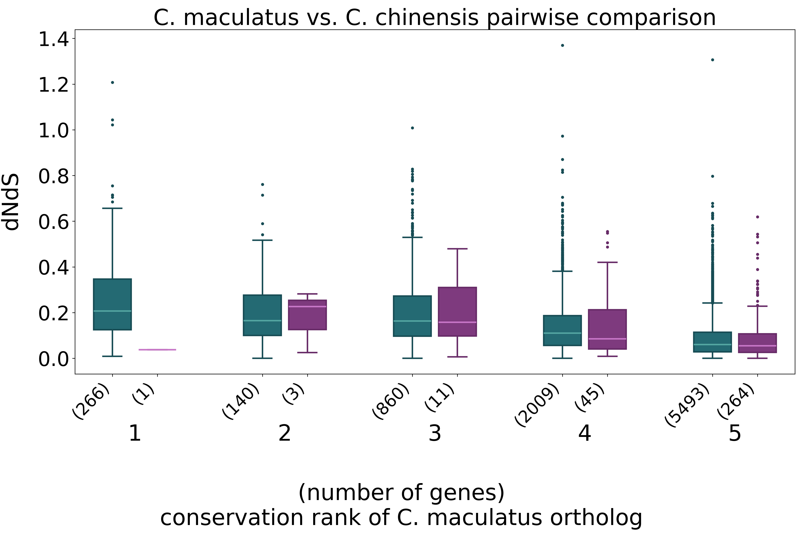
  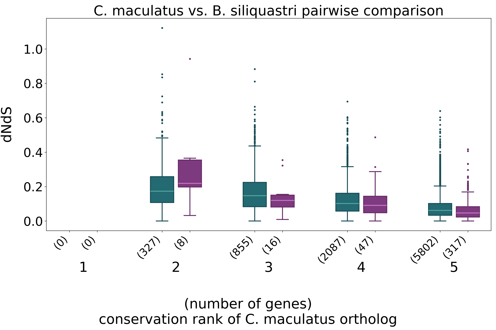
  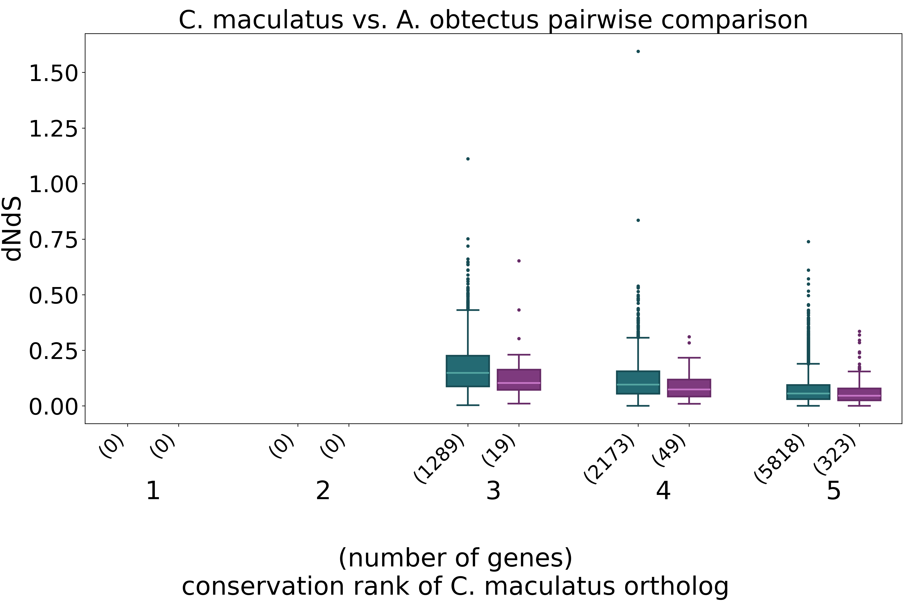
</p>


#### logFC vs. dNdS colored by conservation rank or sex chromosome

Conservation rank goes from 1 to 5, with 5 being highly conserved (up to drosophila) and 1 being only conserved to *C. chinensis*. I am splitting the dNdS into a plot that combines all dNdS values (where some transcript are shown in duplicate due to differing dNdS values in different comparisons, the first plot with no heading), and separate plots for all species. I am only showing transcripts where the log2FC is significant. 

<p float="left">
  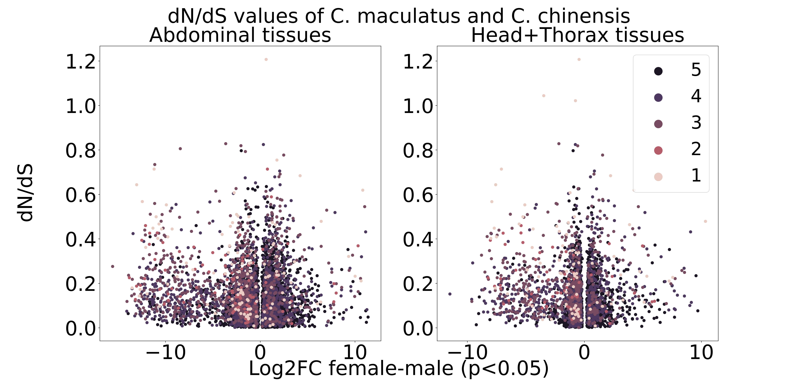
</p>
<p float="left">
  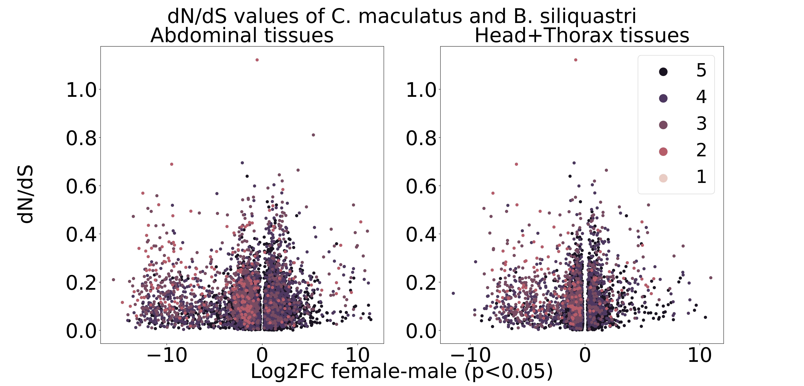
  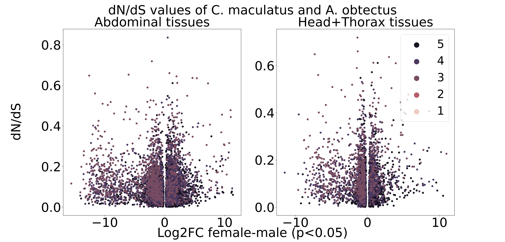
</p>

* Generally, abdominal genes show a larger magnitude of male bias, and also it looks like they have more genes with a low conservation rank. 


<p float="left">
  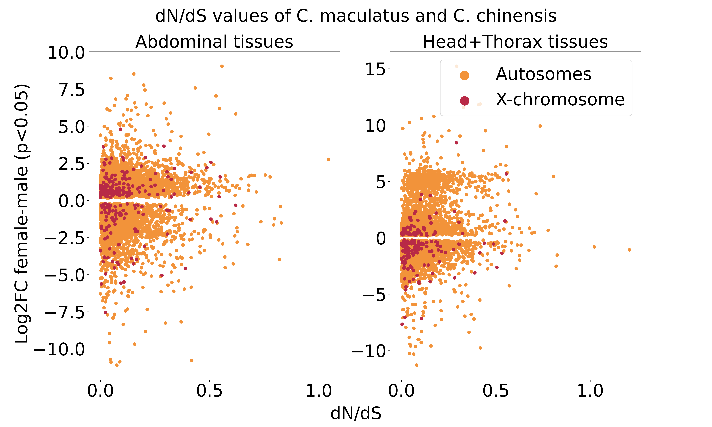
</p>
<p float="left">
  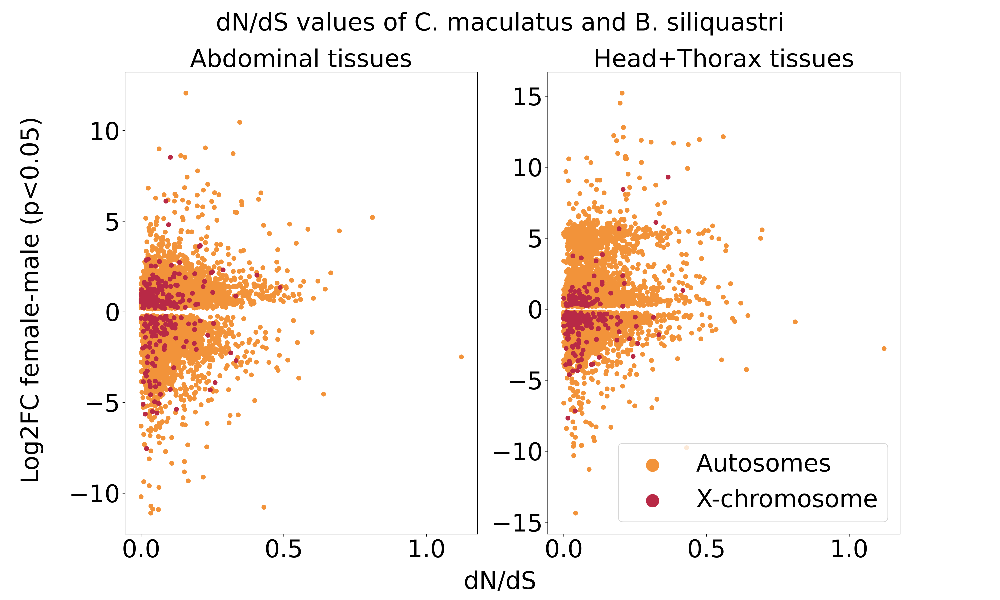
  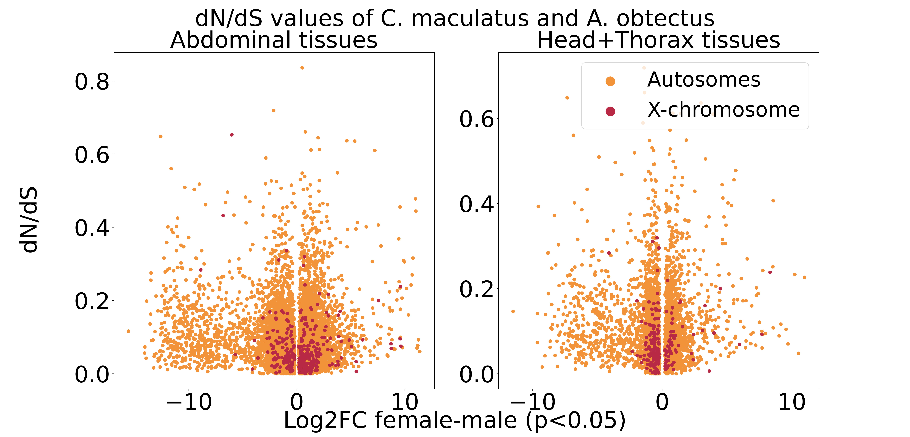
</p>

* Head+thorax tissues for X-linked genes have more male-biased genes, for abdominal genes it's pretty equal  


### logistic regression for positive selection

Since it's only two categories, I am using basic logistic regression and not the ordinal one like for the significantly sex-biased categories as above. The initial regression formula is `positive_selection ~ (LFC_abdomen + LFC_head_thorax) * C(chromosome) * level_most_dist_ortholog` and its not looking great:

NO significance except the intercept, only exceptions are:
* *C. chinensis*:
  * level_most_dist_ortholog (negative coefficient -> higher conservation has less positive selection, which i guess makes sense?)
  * LFC_abdomen:level_most_dist_ortholog (p=0.50)
* *B. siliquastri* (with conservation rank):
  * LFC_head_thorax:C(chromosome)\[T.X\] (p=0.50)

I am running the wald test again to see if there are some parameters that can be cut, and it seems like that conservation rank is not significantly improving the model fit for *B. siliquastri* and *A. obtectus* and so I will exclude it for these species, making the formula `positive_selection ~ (LFC_abdomen + LFC_head_thorax) * C(chromosome)`. This makes chromosome category a main factor (positive coefficient, meaning a higher proportion of positively selected genes on X), but everything else stays insignificant.

How do i interpret this properly? for the closest relative, a higher conservation rank of the ortholog means lower proportion of positively selected genes, but it does not change between the chromosomes. for the more distant species, the chromosome becomes significant suddenly and the conservation rank has no influence any more?

```text
////////////////// C_chinensis ////////////////// (wald test p-value = 0.0154)
===============================================================================================================================
                                                                  coef    std err          z      P>|z|      [0.025      0.975]
-------------------------------------------------------------------------------------------------------------------------------
Intercept                                                      -1.3644      0.173     -7.904      0.000      -1.703      -1.026
C(chromosome)[T.X]                                             -0.3561      1.419     -0.251      0.802      -3.137       2.425
LFC_abdomen                                                     0.1268      0.076      1.668      0.095      -0.022       0.276
LFC_abdomen:C(chromosome)[T.X]                                 -0.0374      0.838     -0.045      0.964      -1.679       1.605
LFC_head_thorax                                                -0.0708      0.135     -0.525      0.600      -0.335       0.194
LFC_head_thorax:C(chromosome)[T.X]                             -0.1281      1.168     -0.110      0.913      -2.418       2.161
level_most_dist_ortholog                                       -0.0913      0.038     -2.422      0.015      -0.165      -0.017
C(chromosome)[T.X]:level_most_dist_ortholog                     0.1857      0.296      0.627      0.530      -0.394       0.766
LFC_abdomen:level_most_dist_ortholog                           -0.0359      0.018     -1.960      0.050      -0.072    6.24e-06
LFC_abdomen:C(chromosome)[T.X]:level_most_dist_ortholog         0.0128      0.181      0.071      0.944      -0.342       0.368
LFC_head_thorax:level_most_dist_ortholog                        0.0282      0.033      0.856      0.392      -0.036       0.093
LFC_head_thorax:C(chromosome)[T.X]:level_most_dist_ortholog    -0.0630      0.260     -0.242      0.808      -0.572       0.446
===============================================================================================================================

////////////////// B_siliquastri ////////////////// (wald test p-value = 0.167)
======================================================================================================
                                         coef    std err          z      P>|z|      [0.025      0.975]
------------------------------------------------------------------------------------------------------
Intercept                             -2.4062      0.040    -60.276      0.000      -2.484      -2.328
C(chromosome)[T.X]                     0.3687      0.172      2.142      0.032       0.031       0.706
LFC_abdomen                            0.0168      0.023      0.718      0.473      -0.029       0.063
LFC_abdomen:C(chromosome)[T.X]        -0.1523      0.113     -1.349      0.177      -0.373       0.069
LFC_head_thorax                        0.0353      0.044      0.793      0.428      -0.052       0.122
LFC_head_thorax:C(chromosome)[T.X]     0.2922      0.190      1.539      0.124      -0.080       0.664
======================================================================================================

////////////////// A_obtectus ////////////////// (wald test p-value = 0.787)
======================================================================================================
                                         coef    std err          z      P>|z|      [0.025      0.975]
------------------------------------------------------------------------------------------------------
Intercept                             -3.0609      0.053    -57.854      0.000      -3.165      -2.957
C(chromosome)[T.X]                     0.5107      0.230      2.225      0.026       0.061       0.961
LFC_abdomen                            0.0585      0.033      1.797      0.072      -0.005       0.122
LFC_abdomen:C(chromosome)[T.X]         0.1176      0.138      0.850      0.395      -0.153       0.389
LFC_head_thorax                       -0.0324      0.060     -0.536      0.592      -0.151       0.086
LFC_head_thorax:C(chromosome)[T.X]    -0.6387      0.369     -1.732      0.083      -1.361       0.084
======================================================================================================

```


<details>
  <summary>other species with conservation rank as fixed factor</summary>

```text
////////////////// B_siliquastri //////////////////
===============================================================================================================================
                                                                  coef    std err          z      P>|z|      [0.025      0.975]
-------------------------------------------------------------------------------------------------------------------------------
Intercept                                                      -2.0571      0.247     -8.332      0.000      -2.541      -1.573
C(chromosome)[T.X]                                             -1.0660      2.007     -0.531      0.595      -5.000       2.868
LFC_abdomen                                                     0.1946      0.104      1.865      0.062      -0.010       0.399
LFC_abdomen:C(chromosome)[T.X]                                  0.7786      0.732      1.064      0.288      -0.656       2.213
LFC_head_thorax                                                 0.0690      0.196      0.352      0.724      -0.315       0.453
LFC_head_thorax:C(chromosome)[T.X]                             -4.0592      2.067     -1.963      0.050      -8.111      -0.007
level_most_dist_ortholog                                       -0.0742      0.054     -1.382      0.167      -0.179       0.031
C(chromosome)[T.X]:level_most_dist_ortholog                     0.3054      0.413      0.740      0.459      -0.503       1.114
LFC_abdomen:level_most_dist_ortholog                           -0.0438      0.025     -1.748      0.080      -0.093       0.005
LFC_abdomen:C(chromosome)[T.X]:level_most_dist_ortholog        -0.2102      0.162     -1.296      0.195      -0.528       0.108
LFC_head_thorax:level_most_dist_ortholog                       -0.0107      0.047     -0.226      0.821      -0.103       0.082
LFC_head_thorax:C(chromosome)[T.X]:level_most_dist_ortholog     0.9504      0.430      2.213      0.027       0.108       1.792
===============================================================================================================================

////////////////// A_obtectus //////////////////
===============================================================================================================================
                                                                  coef    std err          z      P>|z|      [0.025      0.975]
-------------------------------------------------------------------------------------------------------------------------------
Intercept                                                      -3.1559      0.373     -8.470      0.000      -3.886      -2.426
C(chromosome)[T.X]                                             -0.2016      2.268     -0.089      0.929      -4.647       4.243
LFC_abdomen                                                     0.1192      0.174      0.686      0.493      -0.221       0.460
LFC_abdomen:C(chromosome)[T.X]                                 -0.1769      0.856     -0.207      0.836      -1.855       1.501
LFC_head_thorax                                                -0.0151      0.324     -0.047      0.963      -0.649       0.619
LFC_head_thorax:C(chromosome)[T.X]                             -0.0218      2.467     -0.009      0.993      -4.858       4.814
level_most_dist_ortholog                                        0.0217      0.080      0.270      0.787      -0.136       0.179
C(chromosome)[T.X]:level_most_dist_ortholog                     0.1417      0.470      0.301      0.763      -0.780       1.063
LFC_abdomen:level_most_dist_ortholog                           -0.0153      0.041     -0.373      0.709      -0.096       0.065
LFC_abdomen:C(chromosome)[T.X]:level_most_dist_ortholog         0.0689      0.189      0.365      0.715      -0.301       0.439
LFC_head_thorax:level_most_dist_ortholog                       -0.0048      0.077     -0.063      0.950      -0.156       0.146
LFC_head_thorax:C(chromosome)[T.X]:level_most_dist_ortholog    -0.1376      0.538     -0.256      0.798      -1.192       0.917
===============================================================================================================================
```
</details>


# old analysis with *Diorhaba*


I had previously included another pair of sister species: *D.sublineata* and *D. carinulata*. I suspect that *D. carinulata* has a misidentified X chromosome, which leaves it only three X-linked 1-to-1 orthologs between them. I looked into it a bit here, in case it is X turnover. I would need actual lab evidence to conclude that though I think, since the X is so conserved in all the other *Coleoptera* I have here, and I would need coverage or PCR evidence to be sure that the X-identified contig in *D. carinulata* is right.

<details>
  <summary>See old analysis</summary>

## Riparian plot for synteny

I use MCscanX to plot synteny, and [SynVisio](https://synvisio.github.io/) to visualize the riparian plot. *C. chinensis* is not superscaffolded and therefore not included in the plot.

<p float="left">
  
</p>

The X chromosomes are all shown at the right-most side of the plot except *D. carinulata*:
* ao1950 `CAVLJG010000002`
* bs9
* cm124 `utg000057l_1` (scaffold 10 in the superscaffolded version of Cmac)
* dc35 (!) (on the left in the plot)
* ds21

Synteny is conserved within *Bruchini* and within *Diorhabda*, but not between them.

Notably, there is one autosome missing in *A. obtectus*. Since the SynVisio website is not great to use with more species and when unplaced contigs are included, I use the setting to exclude contigs with no synteny blocks on them, which apparently excludes the one missing *A. obtectus* contig.

## No syntenic X in *Diorhabda carinulata*

Despite the broken-down synteny of the autosomes between *Bruchini* and *Diorhabda*, the X chromosomes are all syntenic except *D. carinulata* (dc 35), which is in agreement with the identified 1-to-1 orthologs below, where most pairwise comparisons have 300-400 X-linked orthologs, except any pair involving *D. carinulata*. The "old" syntenic chromosome in *D. carinulata* is `NC_079460.1` (dc13). A part of the *D. carinulata* X is syntenic to *D. sublineata* `NC_079475.1` (ds5).

### Sex chromosome identification methods

Since this is strange, I checked the methods for sex chromosome identification. The assemblys are part of a large effort by the USDA, called USDA-ARS Ag100Pest Initiative and  published [here](https://www.mdpi.com/2075-4450/12/7/626). This does not say anything about the sex chromosomes?? No methods of identification, not even short-read sequencing for coverage analyses


## investigating the three X-lined orthologs in the *D. carinulata* vs. *D. sublineata* comparison

The sequences are these:

| ortholog number       | *D. carinulata*     | *D. sublineata*     | `dNdS`            |
| --------------------- | ------------------- | ------------------- | ----------------- |
| X-linked_ortholog_0   | rna-XM_057814188.1  | rna-XM_056789079.1  | 1.202247191011236 |
| X-linked_ortholog_1   | rna-XM_057812128.1  | rna-XM_056790472.1  | 0.484848484848484 |
| X-linked_ortholog_2   | rna-XM_057811214.1  | rna-XM_056789848.1  | 0.564102564102564 |

I run (web)blast searches for all of them to see if they have a function and check orthofinder output:

* **Ortholog 0:**
  * self-hit [LOC130902232 putative nuclease HARBI1 Dcar](https://www.ncbi.nlm.nih.gov/gene?term=XM_057814188[Nucleotide%20Accession]&RID=PCN67JP7014&log$=genealign&blast_rank=1) and two splice variants
  * self-hit [LOC130450603 putative nuclease HARBI1 Dsub](https://www.ncbi.nlm.nih.gov/gene?term=XM_056789079[Nucleotide%20Accession]&RID=PCNGPR16014&log$=genealign&blast_rank=1) and two splice variants
  * the same putative nuclease in a [dipteran](https://www.ncbi.nlm.nih.gov/gene?term=XM_056066771[Nucleotide%20Accession]&RID=PCN67JP7014&log$=genealign&blast_rank=8)
  * the same putative nuclease in a [hemipteran](https://www.ncbi.nlm.nih.gov/gene?term=XM_046831227[Nucleotide%20Accession]&RID=PCNGPR16014&log$=genealign&blast_rank=9)
  * In the orthofinder analysis, it is part of orthogroup `N0.HOG0000735` which has four members, including the two BRH genes, `rna-AOBTE_LOCUS11149` in Aobt and `rna-XM_056780903.1` in Dsub.
* **Ortholog 1:**
  * uncharacterized hits only, but also some in other insect orders
  * orthogroup `N0.HOG0010332`, which has 6 total members, 3 in Dcar `rna-XM_057809920.1, rna-XM_057815284.1, rna-XM_057812128.1` and 3 in Dsub `rna-XM_056782109.1, rna-XM_056781820.1, rna-XM_056790472.1`
* **Ortholog 2:**
  * uncharacterized hits only, no other insect hits except *D. carinulata* and *D. sublineata*
  * orthogroup `N0.HOG0000356` which has members in all species that I can't be bothered to list right now, see `/proj/naiss2023-6-65/Milena/chapter3/orthofinder/Results_Nov25/Phylogenetic_Hierarchical_Orthogroups/N0.tsv`


## X chromosome turnover in *D. carinulata*

* **Hypothesis about molecular rate on ancestral Dcar X-syntenic chromosome:** As seen in the synteny plot, the X of *D. carinulata* is not syntenic with any of the other species. However, the chromosome dc13 (`NC_079460.1`) is syntenic with the remaining X chromosomes. I hypothesize that this is the result of a recent sex-chromosome turnover in *D. carinulata* where the sex determining locus has moved from the X-syntenic dc13 to dc35 (if the X chromosome is identified correctly). I will repeat the above analysis with the dc13 chromosome for *D. carinulata* instead of the dc35 one which is the actual X, and if the sex chromosome turnover is true I would expect that this still shows slowX since the turnover is much more recent than the long-term evolutionary forces that shape slowX evolution in *Chrysomelidae* (and probably *Coleoptera* in general). 

* **Translocations in Dcar: from ancestral X-syntenic chromosome to neoX chromosome:** The 1-to-1 orthologs that *do* exist between the Dcar X and the other X chromosomes are a bit strange if it really is a neoX, since there should not be true orthologs. This can be one of two things:
  
  * **False-positive ortholog identification:** Potentially due to annotation heterogeneity, genes that are not true 1-to-1 orthologs get identified as such (if e.g. a paralog exists on the syntenic X and neoX, but is not annotated on the syntenic X). I don't know how likely this is here, probably not very? I think I can verify this on a case-by-case basis with a tblastn search of the protein transcript sequence of the neo-X 1-to-1 ortholog in question agains the assembly it comes from to see if there is a paralog on the ancestral X not identified by the annotation.
  * **Translocation of a sex-determining locus:** If a turnover has occured in *D. carinulata*, where the old X-syntenic chromosome has lost its sex determining locus to the neo-X, it could also be through the translocation that could create a few X-linked 1-to-1 orthologs. Additionally, it is notable that the only instance of positive selection on the X chromosome is the *D. carinulata* and *D. sublineata* comparison, which is the pair between which the turnover occurs. We can speculate that the turnover is caused by a translocation of a positively selected (sex determining?) locus and a few linked genes (the other two under negative selection).

### Heatmaps

The Ancestral *D. carinulata* X follows the expectation and has a decent number of X-linked 1-to-1 orthologs with all its comparisons. Notably there are many with its direct sister species, *D. sublineata*, many more than the other pair of sister species *C. maculatus* and *C. chinensis*.

<p float="left">
  
  
</p>

Next steps when uppmax project is back: 

* upload new 1-to-1 fasta files to uppmax, currently here: `/Users/miltr339/work/pairwise_blast_chapter_2_3/brh_tables/brh_sequences_A_Dcar_X_syntenic` and `brh_sequences_X_Dcar_X_syntenic`
* adapt `src/blast_BRH/calculate_batch_pw_dNdS.py` to rerun with the new fasta files (`bash/run_python_wrapper_for_batch_dNdS.sh`)
* extract results with `bash/run_extract_dNdS_results.sh`
* repeat pairwise comparison matrix plot from above

# dS: is slowX caused by elevated mutation rate in the male germline?

The male germline has an elevated mutation rate compared to somatic tissue. Taken together with the fact that the X chromosome spends only 1/3 of its time in males, this leads to the conclusion that the X chromosome has a lower overall mutation rate compared to the autosomes who spend 1/2 of their time in the males. The relative difference in mutation rate can be assessed via the proxy of the synonymous substitution rate `dS`, and an elevated `dS` in the `dN/dS` ratio would result in a lower `dN/dS` in the X chromosomes compared to the autosomes, which we observe as slowX. I want to test this hypothesis with two analyses:

* Plot `dS` of X and A genes, see if elevated on A.
* Plot `dS` vs. `dNdS`, fit linear regression line (or non-linear regression depending on what it looks like?), see if there is a difference of X-linked or A-linked orthologs.

## dS comparison between A and X

these are the preliminary results of the dS vs. dNdS values of what I have available locally, the rest has to wait until the compute project is back.

```text
# Bruchini
0, 1 : A_obtectus   vs. C_maculatus     --> mean/median dS A: 1.218/1.113,  mean/median dS X: 1.011/0.924
0, 3 : A_obtectus   vs. C_chinensis     --> mean/median dS A: 1.202/1.100,  mean/median dS X: 1.190/0.983
0, 5 : A_obtectus   vs. B_siliquastri   --> mean/median dS A: 1.113/1.007,  mean/median dS X: 1.059/0.963
1, 5 : C_maculatus  vs. B_siliquastri   --> mean/median dS A: 0.790/0.722,  mean/median dS X: 0.686/0.680
1, 3 : C_maculatus  vs. C_chinensis     --> mean/median dS A: 0.468/0.422,  mean/median dS X: 0.407/0.371
3, 5 : C_chinensis  vs. B_siliquastri   --> mean/median dS A: 0.833/0.797,  mean/median dS X: 0.815/0.718

# comparison bruchini vs. Diorhabda
0, 4 : A_obtectus   vs. D_sublineata    --> mean/median dS A: 2.836/3.000,  mean/median dS X: 2.869/3.000
0, 2 : A_obtectus   vs. D_carinulata    --> mean/median dS A: 2.985/3.000,  mean/median dS X: 2.894/3.000
1, 2 : C_maculatus  vs. D_carinulata    --> mean/median dS A: 2.841/3.000,  mean/median dS X: 2.738/3.000
1, 4 : C_maculatus  vs. D_sublineata    --> mean/median dS A: 2.897/3.000,  mean/median dS X: 2.932/3.000
3, 4 : C_chinensis  vs. D_sublineata    --> mean/median dS A: 2.835/3.000,  mean/median dS X: 2.804/3.000
2, 3 : D_carinulata vs. C_chinensis     --> mean/median dS A: 2.915/3.000,  mean/median dS X: 2.564/3.000
2, 5 : D_carinulata vs. B_siliquastri   --> mean/median dS A: 2.996/3.000,  mean/median dS X: 2.857/3.000
4, 5 : D_sublineata vs. B_siliquastri   --> mean/median dS A: 2.872/3.000,  mean/median dS X: 2.899/3.000

# Diorhabda
not available in preliminary data
```

## dS vs. dNdS correlation

* **Top right:** violin plots with median lines, point to dS being slightly lower in X-lined orthologs (median lines often identical in pairs where there's lots of occurences of `dS=3`)
* **Bottom left:** scatterplots of dS vs. dNdS, linear regression calculated with `scipy.stats.linregress`
  * Not a super clear linear function, but also not really anything else. may be better with more datapoints?
    * not really a consistent difference in slope where A or X is lower?
  * line is dotted when residuals are not normally distributed (unsure how problematic that is?)
    * since the point is that I want to see a difference in slope, maybe do ANCOVA for the actual analysis of significant difference?

<p float="left">
    
</p>

<details open>
  <summary>plot of all species pairs, including D. carinulata and D. sublineata</summary>
  
  **Many occurences of dS=3:** dS is the substitution rate *per codon*, and since a codon has only three nucleic acids 
  
  <p float="left">
    
  </p>
</details>


# MK test

From [Kousathanas 2014](https://academic.oup.com/genetics/article/196/4/1131/5935629#403207161): "*The standard MK test compares the ratio of nonsynonymous to synonymous divergence (dN/dS) between two species with the ratio of nonsynonymous to synonymous polymorphism (pN/pS) within a species. Because positively selected mutations are not expected to contribute substantially to polymorphism, an excess of dN/dS relative to pN/pS is interpreted to be the result of adaptive substitutions. The rate of molecular adaptation is usually quantified by calculating the proportion of substitutions that have been fixed by positive selection (α) as α=(dN-dS(pN/pS))/(dN)*". See the entire section on "Measuring the rate of molecular adatpation"

maybe with this: https://frubino.github.io/scripts/pnps_gen.html?

In general, it also just tests for positive selection, and since we already mostly have this covered with the site model, I don't think it's necessary.

</details>