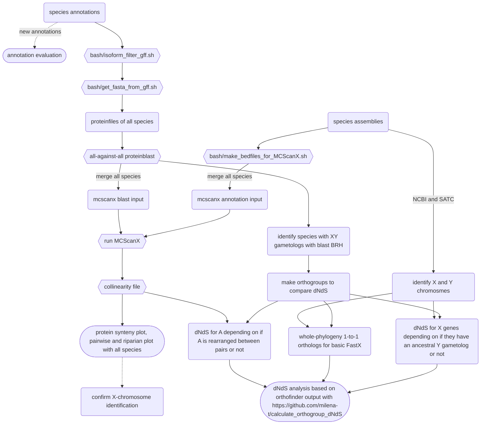
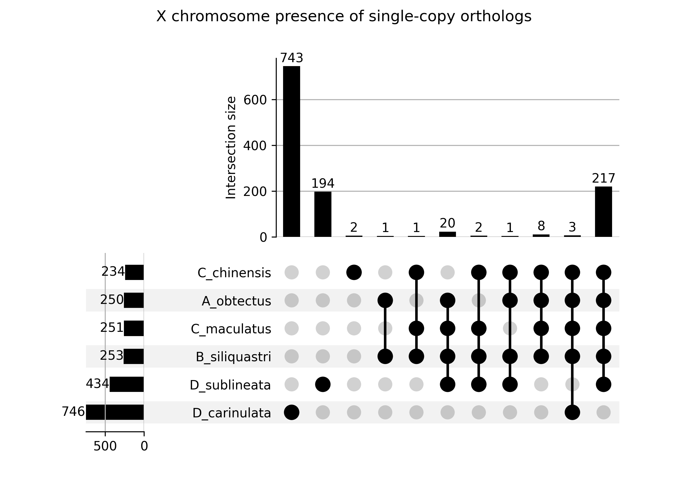
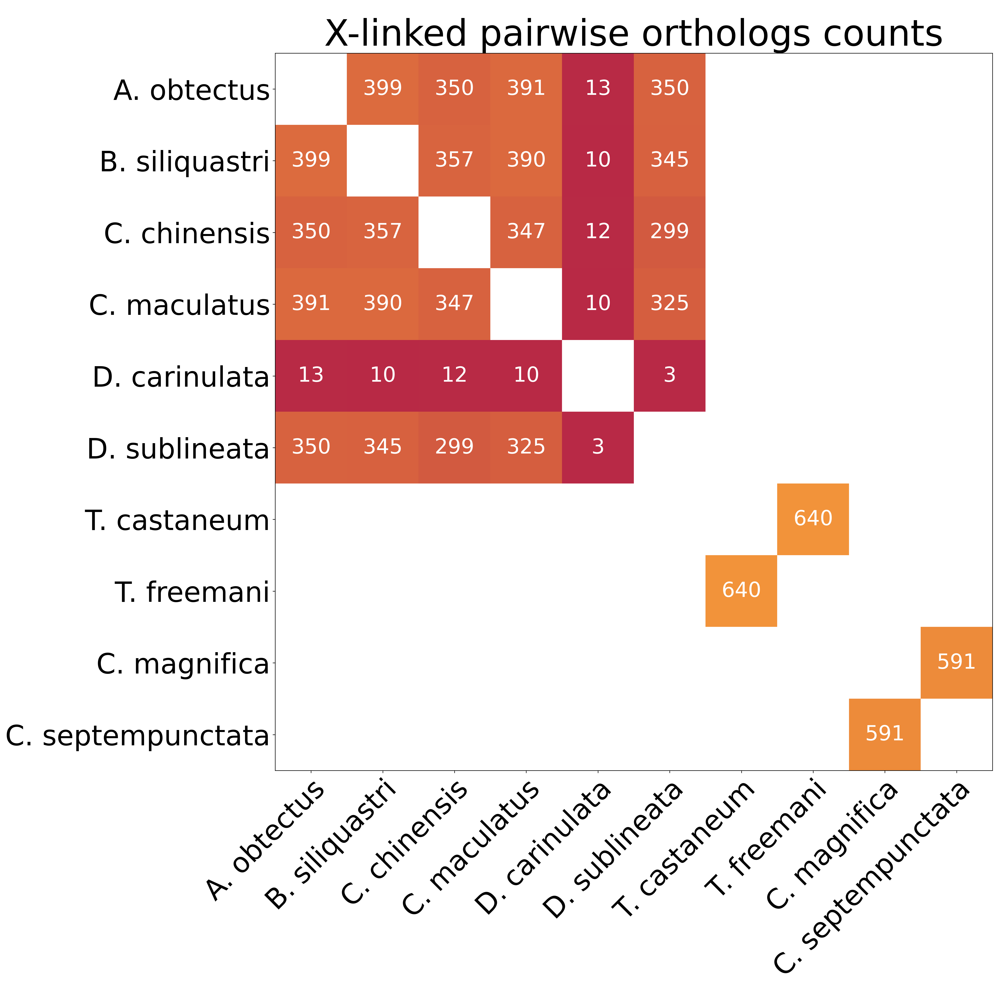
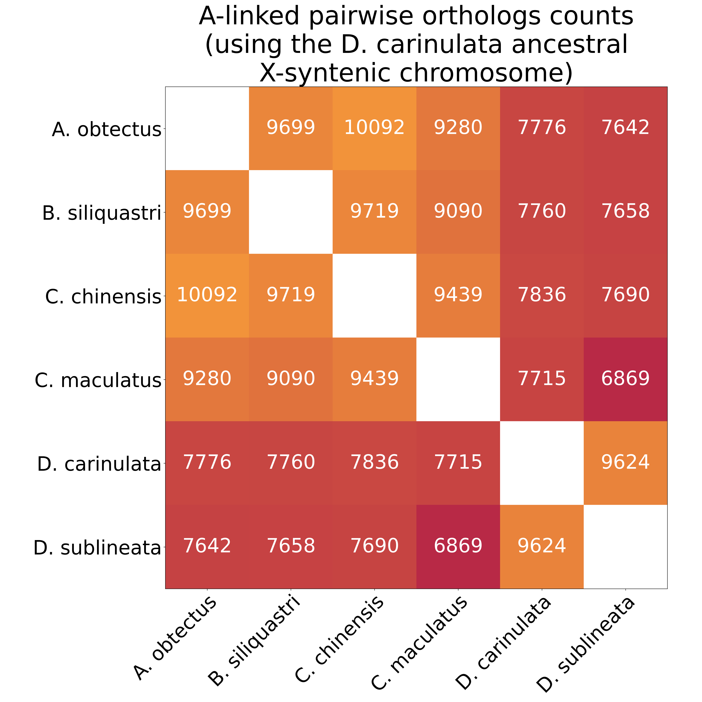
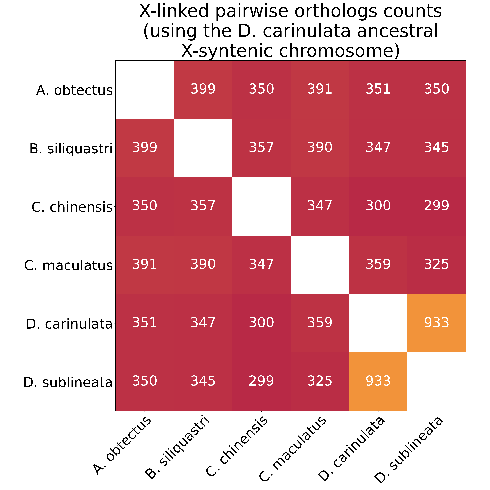
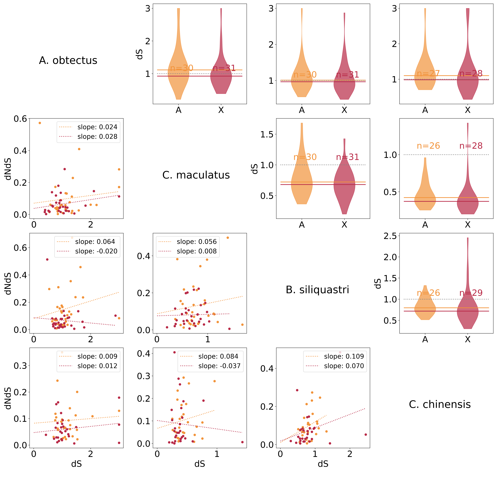

# Chapter III: FastX in coleoptera

## Other code

I wrote a lot of code for this a year ago here: https://github.com/milena-t/calculate_orthogroup_dNdS

## Notes

DTOL open data release policy [here](https://www.darwintreeoflife.org/wp-content/uploads/2024/10/DToL-Open-Data-Release-Policy.docx_.pdf)

### Methods

* [Martinez-Pacheco 2020](https://academic.oup.com/gbe/article/12/11/2015/5892261) 
  * double check y linked gene presence by `blastn` against the assembly.
  * *"the best BlastN match (usually around 92–95% identity over the entire sequence) onto the annotated X chromosome of the reference genomes was considered the X gametologs"*
  * [Marques 2005](https://journals.plos.org/plosbiology/article?id=10.1371/journal.pbio.0030357) for identifying retrogenes. blast proteins against assembly, merge nearby matches, *"query and target sequences had >50% similarity on the amino acid level and over >80% of their length* \[are\] *shared"*, verify absence of introns. with some `paml` stuff, they identified the ancestral gametolog that all retrogenes originate from (useful for FastX?)
* **[Whittle 2020](https://academic.oup.com/g3journal/article/10/3/1125/6026234): no FastX in beetles**. only compared between *T. castaneum* and *T. freemani*, X enriched for female-biased genes, no X dosage compensation in the testes. 
  * TODO read in more detail about what they say about the influence of the (lack of) dosage compensation on fastX.
  * also check methods for alignment filtering: *"It has been suggested that removal of highly divergent segments from alignments, while causing loss of some sequence regions, improves measurements of protein sequence divergence; thus, highly divergent segments were excluded using the program Gblocks v. 0.91b set at default parameters (Castresana 2000; Talavera and Castresana 2007)."*
  * Divergence time 12-47 MYA ([Angelini 2008](https://www.sciencedirect.com/science/article/pii/S1055790307002941?via%3Dihub)) which is unfortunately not super informative when trying to figure out if they are more or less far apart than *C. maculatus* and *C. chinensis*.
* [Mank 2009](https://academic.oup.com/mbe/article/27/3/661/1000994?login=true) Faster-Z in birds is mainly due to drift
  * Positive selection would be fixation of recessive male-biased mutations
* [Mank 2007](https://academic.oup.com/mbe/article/24/12/2698/978299) faster evolutionary rate of female biased genes in bird brains (not male biased)
  * Note the ZW system in birds
  * 
* [Li 2010](https://pubmed.ncbi.nlm.nih.gov/21035095/) FastZ in duplicates compared to autosomal duplicates
  * within-species comparison, make all pairwise dN/dS of all genes within a gene family (check methods specifically that they use to reduce between-sample depencence for statistical power)
  
### Expectations

* Retrotransposition of male-biased genes from X to A ([Ellegren 2011](https://www.nature.com/articles/nrg2948.pdf))
* Ampliconic regions on both X and Y, expansion of intergenic regions

### Results

* TODO read: [Vicoso & Bachtrog 2006](https://www.nature.com/articles/nrg1914) Big early paper that everyone cites about the different evolutionary forces that act differently on the X vs the autosomes
* [Navarro 2003](https://www.science.org/doi/full/10.1126/science.1080600) accelerated evolutionary rate on rearranged chromosomes between species
* (Review)[Ellegren 2011](https://www.nature.com/articles/nrg2948.pdf) review on the influence of heterogameity on sex chromosome evolution
  * *"For example, long interspersed repeat elements are enriched on both the mammalian X and the avian Z chromosome \[46,47\], whereas gene  density is lower than on autosomes in both systems as a result of intergenic expansions \[27,48\]"*
  * He also says about the selection pressure on X-linked genes in the heterogametic sex that *selection will occur more frequently* as opposed to that it is stronger, which I think doesn't change the outcome because the selection is stronger in the end compared to the autosomes due to it occuring more frequently
  * *Among the genes that generate new retrocopies, through mRNA intermediates, there is an excess of X-linked genes inserted at autosomal locations.* Might be because X linked genes are temporarily inactivated during meiosis in males (meiotic sex-chromosome inactivation **MSCI**), and genes that give selective advantage to males want to escape. The retrocopies that leave often aquire male-specific function, because, if dominant, they spread easier on the autosomes because they are temporarily inactivated on the X negating their selective advantage
  * References about Gene traffic to and from the X chromosome
    * Emerson, J. J., Kaessmann, H., Betran, E. & Long, M. Extensive gene traffic on the mammalian X chromosome. Science 303, 537–540 (2004)
    * Shiao, M. S. et al. Origins of new male germ-line functions from X-derived autosomal retrogenes in the mouse. Mol. Biol. Evol. 24, 2242–2253 (2007).
    * Vinckenbosch, N., Dupanloup, I. & Kaessmann, H. Evolutionary fate of retroposed gene copies in the human genome. Proc. Natl Acad. Sci.USA 103, 3220–3225 (2006).
    * Meisel, R. P., Han, M. V. & Hahn, M. W. A complex suite of forces drives gene traffic from Drosophila X chromosomes. Genome Biol. Evol. 1, 176–188 (2009).
    * Vibranovski, M. D., Zhang, Y. & Long, M. General gene movement off the X chromosome in the Drosophila genus. Genome Res. 19, 897–903
  (2009)
* [Yu 2026](https://www.pnas.org/doi/full/10.1073/pnas.2522417123) super conserved noncoding sex determining locus in (haplodiploid) hymenoptera

## Workflow

<details>
<summary>Flowchart for my pipeline</summary>



</details>

### Species selection

I want to look at groups of sister-species to take into account the evolutionary distance when comparing dN/dS ratio

* Include *Tribolium freemani* as a sister species to *T. castaneum* because of Whittle2020, T. freemani assembly [here](https://www.ebi.ac.uk/ena/browser/view/GCA_022388455.1)
  * no annotation available -> but RNAseq so I am annotating it myself from scratch
* include *Coccinella magnifica* (darwin tree of life project, [here](https://ftp.ncbi.nlm.nih.gov/genomes/all/GCA/965/644/565/GCA_965644565.1_icCocMagn1.hap1.1/)) as sister species to *Coccinella septempunctata*
  * no annotation available
  * Timetree says that they are "tne same species" so unclear what that means for their phylogenetic distance
* other *Chrysomelidae*
  * *D. virgifera virgifera* [here](https://www.ncbi.nlm.nih.gov/datasets/genome/GCF_917563875.1/) with no identified X chromosome
  * *Phyllotreata striolata* [here](https://www.ncbi.nlm.nih.gov/datasets/genome/GCA_918026865.1/) with no identified X chromosome
  * *Diabrotica undecimpunctata* [here](https://www.ncbi.nlm.nih.gov/datasets/genome/GCF_040954645.1/) with no identified X chromosome
  * *Diabrotica balteata* [here](https://www.ncbi.nlm.nih.gov/datasets/genome/GCA_918026665.1/) with no identified X chromosome
  * *Phaedon cochleariae* [here](https://www.ncbi.nlm.nih.gov/datasets/genome/GCA_918026855.4/) with no identified X chromosome
  * *Psylliodes chrysocephalus* [here](https://www.ncbi.nlm.nih.gov/datasets/genome/GCA_927349885.1/) (probably not this one? has a lot of chromosomes so identifying the X via synteny is not super viable) 
  * *Pseudozyma brasiliensis* [here](https://www.ebi.ac.uk/ena/browser/view/GCA_000497045.1?show=assembly-stats). 
    * no X identified
    * can't find an annotation, but in the associated [publication](https://journals.asm.org/doi/10.1128/genomea.00920-13#sec-1) it says that "*A total of 5,768 protein-encoding genes were identified, which is similar to the gene content of other Pseudozyma spp*", which seems weird? very few genes
  * 

I have annotated *T. freemani* with available RNAseq data from Whittle2020, but there was no RNAseq data for *C. septempunctata*. 

<details>
<summary>Annotation Evaluation</summary>

#### BUSCO scores

```text
C. maculatus superscaffolded (adult LOME RNAseq but no larval)
(19022 genes)

C:98.7%[S:72.2%,D:26.5%],F:0.6%,M:0.7%,n:1013	   
999	Complete BUSCOs (C)			   
731	Complete and single-copy BUSCOs (S)	   
268	Complete and duplicated BUSCOs (D)	   
6	Fragmented BUSCOs (F)			   
8	Missing BUSCOs (M)			   
1013	Total BUSCO groups searched
```

#### Single exon genes

<p float="left">
  
</p>

</details>

### sex chromosome identification

* **Bruchids**
  * *C. maculatus:* from Kaufmann et al.: 
    ```python
    { X : ['utg000057l_1','utg000114l_1','utg000139l_1','utg000191l_1','utg000326l_1','utg000359l_1','utg000532l_1','utg000602l_1'],
      Y : ['utg000322l_1','utg 000312c_1','utg 000610l_1','utg 001235l_1']}
    ## superscaffolded
    { X : ['scaffold_10','scaffold_14','scaffold_23','scaffold_31','scaffold_34','scaffold_83'],
      Y : ['scaffold_26','scaffold_48','scaffold_103','scaffold_112','scaffold_164']}
    ``` 
  
  * *C. chinensis:*
    identified by me, but the assembly is very fragmented so there is a lot of contigs.

    ```python
    { X : ["1211_quiver","1844_quiver","854_quiver","5741_quiver","2866_quiver","658_quiver","1498_quiver","1455_quiver","2404_quiver","2935_quiver","1115_quiver","370_quiver","2273_quiver","1424_quiver","1865_quiver","767_quiver","2222_quiver","1525_quiver","5023_quiver","1925_quiver","1217_quiver","2328_quiver","2475_quiver","959_quiver","537_quiver","2776_quiver","325_quiver","2576_quiver","2336_quiver","988_quiver","2252_quiver","1388_quiver","1508_quiver","1712_quiver","1260_quiver","977_quiver","2202_quiver","2223_quiver","2397_quiver","693_quiver","1092_quiver","2189_quiver","1958_quiver","1355_quiver","2241_quiver","849_quiver","703_quiver","277_quiver","518_quiver","2589_quiver","1326_quiver","2962_quiver","2341_quiver","358_quiver","462_quiver","2786_quiver","1116_quiver","525_quiver","1358_quiver","5693_quiver","1429_quiver","1253_quiver","2372_quiver","326_quiver","474_quiver","777_quiver","955_quiver","1852_quiver","718_quiver","1024_quiver","1974_quiver","2295_quiver","2356_quiver","1484_quiver","1503_quiver","3076_quiver","2091_quiver","1262_quiver","1109_quiver","1475_quiver","1695_quiver","1168_quiver","1386_quiver","2201_quiver","2320_quiver","1117_quiver","769_quiver","2050_quiver","1805_quiver","2692_quiver","411_quiver","851_quiver","5703_quiver","1585_quiver","824_quiver","1816_quiver","1370_quiver","2416_quiver","1814_quiver","1277_quiver","619_quiver","1750_quiver","2709_quiver","2664_quiver","1250_quiver","971_quiver","3020_quiver","310_quiver","1176_quiver","2510_quiver","1699_quiver","1256_quiver","1420_quiver","5727_quiver","413_quiver","1124_quiver","682_quiver","1000_quiver","1313_quiver","5708_quiver","1556_quiver","274_quiver","1787_quiver","1137_quiver","360_quiver","1469_quiver","1853_quiver","2380_quiver","1239_quiver","993_quiver","791_quiver","2540_quiver","1510_quiver","868_quiver","505_quiver","1212_quiver","376_quiver","1564_quiver","1836_quiver","1670_quiver","500_quiver","2099_quiver","353_quiver","1042_quiver","419_quiver","1314_quiver","1339_quiver","1470_quiver","1576_quiver","1717_quiver","5692_quiver","2157_quiver","700_quiver","1284_quiver","1694_quiver","2306_quiver","2712_quiver","182_quiver","1973_quiver","882_quiver","2363_quiver","2482_quiver","1640_quiver","1913_quiver","2323_quiver","1240_quiver","161_quiver","1649_quiver","1164_quiver","1054_quiver","1096_quiver","313_quiver","1815_quiver","1831_quiver","1349_quiver","151_quiver","1478_quiver","1523_quiver","1888_quiver","739_quiver","1322_quiver","2338_quiver","1798_quiver","1391_quiver","1530_quiver","1519_quiver","1651_quiver","1105_quiver","509_quiver","1308_quiver","1833_quiver","1914_quiver","1741_quiver","1080_quiver","2292_quiver","2364_quiver","643_quiver","5745_quiver","1920_quiver","1725_quiver","125_quiver","1086_quiver","2552_quiver","5749_quiver","2120_quiver","2964_quiver","5722_quiver","2045_quiver","2422_quiver","593_quiver","1496_quiver","1772_quiver","799_quiver","2690_quiver","414_quiver","1531_quiver","1443_quiver","1408_quiver","1688_quiver","1371_quiver","1501_quiver","3090_quiver","1025_quiver","5698_quiver","347_quiver","1435_quiver","476_quiver","1883_quiver","2820_quiver","5728_quiver","342_quiver","1972_quiver","1826_quiver","968_quiver","2037_quiver","1723_quiver","252_quiver","1863_quiver","2983_quiver","1947_quiver","1430_quiver","1612_quiver","1701_quiver","839_quiver","613_quiver","1979_quiver","1584_quiver","2024_quiver","1486_quiver","1097_quiver"],
      Y : ["850_quiver","949_quiver","1088_quiver","1125_quiver","1159_quiver","1134_quiver","1224_quiver","1369_quiver","1410_quiver","1568_quiver","1577_quiver","1619_quiver","1634_quiver","1646_quiver","1652_quiver","1665_quiver","1681_quiver","1697_quiver","1722_quiver","1766_quiver","1783_quiver","1891_quiver","1937_quiver","1963_quiver","1790_quiver","1997_quiver","2073_quiver","2113_quiver","2163_quiver","2166_quiver","5705_quiver","2245_quiver","2259_quiver","2260_quiver","2334_quiver","2340_quiver","2382_quiver","2443_quiver","2511_quiver","2534_quiver","2573_quiver","2597_quiver","2651_quiver","2707_quiver","2766_quiver","2773_quiver","2791_quiver","2830_quiver","2875_quiver","3022_quiver","3070_quiver","3074_quiver","3075_quiver","3078_quiver"]}
    ```
  * *B. siliquastri* identified by the DTOL project with the assembly
    ```python
    { X : ['X'],
      Y : ['Y']}
    ``` 
  * *A. obtectus* Identified by me and Göran's project about it
    ```python
    #### TODO double check these contig IDs
    { X : ["CAVLJG010000002.1","CAVLJG010003236.1","CAVLJG010003544.1","CAVLJG010000099.1","CAVLJG010000155.1","CAVLJG010000244.1","CAVLJG010000377.1","CAVLJG010000488.1",],
      Y : ["CAVLJG010000343.1","CAVLJG010002896.1","CAVLJG010000233.1","CAVLJG010000566.1","CAVLJG010000588.1",]}
    ``` 
    <details>
    <summary>A_obtectus chromosome name conversions</summary>
    The chromosome names in the ENA version of the assembly are weird, a whole header is like 
    ```
    >ENA_CAVLJG010000002_CAVLJG010000002.1 Acanthoscelides obtectus genome assembly, contig: chr_10
    >ENA_CAVLJG010002896_CAVLJG010002896.1 Acanthoscelides obtectus genome assembly, contig: scaffold_36
    ```
    and somehow in the mapping for the sex chromosome identification that Angela did, the contigs are identified as `chr_10` and `scaffold_36`, and not as `CAVLJG010000002.1`. This is confusing because in the original version of this assembly on uppmax after superscaffolding before it was deposited, the contigs are named like `HiC_scaffold_1`, and these scaffold numbers do *not* correspond to the ones in the ENA/NCBI headers! To be super clear I list below the complete X and Y association, which I need for further analyses because the annotation obviously uses `CAVLJG010000002.1` and not some weird tail end of the header.

    ```text
    X-contigs > 100 kb:
    * chr_10 :       CAVLJG010000002.1, 43142905 bp
    * scaffold_49 :  CAVLJG010003236.1, 333528 bp
    * scaffold_77 :  CAVLJG010003544.1, 217000 bp
    * scaffold_108 : CAVLJG010000099.1, 157500 bp
    * scaffold_113 : CAVLJG010000155.1, 147000 bp
    * scaffold_121 : CAVLJG010000244.1, 129500 bp
    * scaffold_133 : CAVLJG010000377.1, 114918 bp
    * scaffold_143 : CAVLJG010000488.1, 105500 bp

    Y-contigs > 100 kb:
    * scaffold_13 :  CAVLJG010000343.1, 1187000 bp
    * scaffold_36 :  CAVLJG010002896.1, 421500 bp
    * scaffold_120 : CAVLJG010000233.1, 131000 bp
    * scaffold_150 : CAVLJG010000566.1, 100909 bp
    * scaffold_152 : CAVLJG010000588.1, 100000 bp
    ```
    </details>

* **Diorhabada** 
  * [Diorhabda sublineata](https://www.ncbi.nlm.nih.gov/datasets/genome/GCF_026230105.1/)
  ```python
  { X : ['NC_079485.1'],
    Y : ['NC_079486.1']} 
  ``` 
  * [Diorhabda carinulata](https://www.ncbi.nlm.nih.gov/datasets/genome/GCF_026250575.1/)
  ```python
  { X : ['NC_079472.1'],
    Y : ['NC_079473.1']} 
  ``` 
  * There is also Diabrotica undecimpunctata but it does not have sex chromosomes identified, but it does have a giant genome at 1.7Gb


# Riparian plot for synteny

I use MCscanX to plot synteny, and [SynVisio](https://synvisio.github.io/) to visualize the riparian plot. *C. chinensis* is not superscaffolded and therefore not included in the plot.

<p float="left">
  
</p>

The X chromosomes are all shown at the right-most side of the plot except *D. carinulata*:
* ao1950 `CAVLJG010000002`
* bs9
* cm124 `utg000057l_1` (scaffold 10 in the superscaffolded version of Cmac)
* dc35 (!) (on the left in the plot)
* ds21

Synteny is conserved within *Bruchini* and within *Diorhabda*, but not between them.

Notably, there is one autosome missing in *A. obtectus*. Since the SynVisio website is not great to use with more species and when unplaced contigs are included, I use the setting to exclude contigs with no synteny blocks on them, which apparently excludes the one missing *A. obtectus* contig.

## No syntenic X in *Diorhabda carinulata*

Despite the broken-down synteny of the autosomes between *Bruchini* and *Diorhabda*, the X chromosomes are all syntenic except *D. carinulata* (dc 35), which is in agreement with the identified 1-to-1 orthologs below, where most pairwise comparisons have 300-400 X-linked orthologs, except any pair involving *D. carinulata*. The "old" syntenic chromosome in *D. carinulata* is `NC_079460.1` (dc13). A part of the *D. carinulata* X is syntenic to *D. sublineata* `NC_079475.1` (ds5).

# ortholog identification

I will use the complete X contig list from the beginning, *not* just the syntenic contigs shown in the riparian plot.

## orthofinder

In the original analysis with Lila we ran orthofinder and used the orthologs that are 1-to-1 across all species. With the new species selection, I tried that here as well, but it seems like the *Diorhabda* X chromosomes are not syntenic. 

<p float="left">
  
</p>

## best reciprocal hits

All comparisons of dNdS to identify fastX are always pairwise. Therefore it doesn't matter that a gene is 1-to-1 in all the species, only in the pair where i actually do the calculation. I will use the all-vs-all proteinblast that I made for the synteny with MCScanX (see chapter 2) to identify best reciprocal hits between pairs instead.

<p float="left">
  
  
</p>


I also check for gametologs (genes where there is a 1-to-1 homolog on the X and Y chromosome in the same species). the within-species gametolog counts are unfortunately very low:

* *A. obtectus* : 3
* *B. siliquastri* : 4
* *C. chinensis* : 1
* *C. maculatus* : 4
* *D. carinulata* : 3
* *D. sublineata* : 0

I suspect that this is not because there are no ancestral gametologs, but because there have been more recent duplications on X and/or Y. This would make them not 1-to-1 any more and therefore not identified in this test.

## Conclusion

I will continue with best reciprocal hits, becasue the orthofinder clustering is a bit more "relaxed", meaning that a transcript is more likely to be included in an orthogorup. Since I am only using pairwise comparisons, this method may make larger orthogroups that would not qualify as 1-to-1 orthologs, and therefore reduce the sample size for our dNdS analysis.

# dNdS: slow X or fast X?

The dNdS is calculated between all pairwise comparisons for A-linked and X-linked genes identified with BRH above. I am doing unique comparisons only below, so (Cmac,Aobt) is the same as (Aobt,Cmac) which is why only one of them is shown. Also, self-comparisons make no sense here so I am excluding them as well. I show horizontal lines of the median dNdS for A and X in matching colors to the violin plot to clearly show the mean difference in dNdS. 

Most species are slowX, except the *D. carinulata* comparisons, but those have such a low sample size for X-linked genes that the mean is not reliable. 

## Statistical analysis via permutation test

Generally, all species pairs seem to show slowX, but I will do a permutation test for each species pair like this:

1. **Sample without replacement:** Merge A and X dNdS values into one list, sample new A and new X lists with original sample sizes without replacement
2. **Calculate median:** Calculate median A and median X from resampled lists, use difference A - X
3. **Normal distribution:** Compute a normal distribution from all median(A) - median(X) values, find 95% confidence intervals
4. **Plot:** Histrogram and normal distribution, compare original observed dNdS_A - dNdS_X to 95% confidence intervals of the permutations

I have chosen 10000 permutations for now, this takes less than 10 mins. 

The top right is all the permutation tests. the pink line is the measured `dNdS_A - dNdS_X`, while green is the distributions from the permutation test. Since I am plotting `dNdS_A - dNdS_X`, and I mostly observe `dNdS_A - dNdS_X > 0`, which means `dNdS_A > dNdS_X`, this indicates slowX. the bottom right is the same violin plot as above. Note the low sample sizes for *D. carinulata* X, which are "hidden" in the permutation test.

<p float="left">
  
</p>

### investigating the three X-lined orthologs in the *D. carinulata* vs. *D. sublineata* comparison

The sequences are these:

| ortholog number       | *D. carinulata*     | *D. sublineata*     | `dNdS`            |
| --------------------- | ------------------- | ------------------- | ----------------- |
| X-linked_ortholog_0   | rna-XM_057814188.1  | rna-XM_056789079.1  | 1.202247191011236 |
| X-linked_ortholog_1   | rna-XM_057812128.1  | rna-XM_056790472.1  | 0.484848484848484 |
| X-linked_ortholog_2   | rna-XM_057811214.1  | rna-XM_056789848.1  | 0.564102564102564 |

I run (web)blast searches for all of them to see if they have a function and check orthofinder output:

* **Ortholog 0:**
  * self-hit [LOC130902232 putative nuclease HARBI1 Dcar](https://www.ncbi.nlm.nih.gov/gene?term=XM_057814188[Nucleotide%20Accession]&RID=PCN67JP7014&log$=genealign&blast_rank=1) and two splice variants
  * self-hit [LOC130450603 putative nuclease HARBI1 Dsub](https://www.ncbi.nlm.nih.gov/gene?term=XM_056789079[Nucleotide%20Accession]&RID=PCNGPR16014&log$=genealign&blast_rank=1) and two splice variants
  * the same putative nuclease in a [dipteran](https://www.ncbi.nlm.nih.gov/gene?term=XM_056066771[Nucleotide%20Accession]&RID=PCN67JP7014&log$=genealign&blast_rank=8)
  * the same putative nuclease in a [hemipteran](https://www.ncbi.nlm.nih.gov/gene?term=XM_046831227[Nucleotide%20Accession]&RID=PCNGPR16014&log$=genealign&blast_rank=9)
  * In the orthofinder analysis, it is part of orthogroup `N0.HOG0000735` which has four members, including the two BRH genes, `rna-AOBTE_LOCUS11149` in Aobt and `rna-XM_056780903.1` in Dsub.
* **Ortholog 1:**
  * uncharacterized hits only, but also some in other insect orders
  * orthogroup `N0.HOG0010332`, which has 6 total members, 3 in Dcar `rna-XM_057809920.1, rna-XM_057815284.1, rna-XM_057812128.1` and 3 in Dsub `rna-XM_056782109.1, rna-XM_056781820.1, rna-XM_056790472.1`
* **Ortholog 2:**
  * uncharacterized hits only, no other insect hits except *D. carinulata* and *D. sublineata*
  * orthogroup `N0.HOG0000356` which has members in all species that I can't be bothered to list right now, see `/proj/naiss2023-6-65/Milena/chapter3/orthofinder/Results_Nov25/Phylogenetic_Hierarchical_Orthogroups/N0.tsv`


## X chromosome turnover in *D. carinulata*

* **Hypothesis about molecular rate on ancestral Dcar X-syntenic chromosome:** As seen in the synteny plot, the X of *D. carinulata* is not syntenic with any of the other species. However, the chromosome dc13 (`NC_079460.1`) is syntenic with the remaining X chromosomes. I hypothesize that this is the result of a recent sex-chromosome turnover in *D. carinulata* where the sex determining locus has moved from the X-syntenic dc13 to dc35 (if the X chromosome is identified correctly). I will repeat the above analysis with the dc13 chromosome for *D. carinulata* instead of the dc35 one which is the actual X, and if the sex chromosome turnover is true I would expect that this still shows slowX since the turnover is much more recent than the long-term evolutionary forces that shape slowX evolution in *Chrysomelidae* (and probably *Coleoptera* in general). 

* **Translocations in Dcar: from ancestral X-syntenic chromosome to neoX chromosome:** The 1-to-1 orthologs that *do* exist between the Dcar X and the other X chromosomes are a bit strange if it really is a neoX, since there should not be true orthologs. This can be one of two things:
  
  * **False-positive ortholog identification:** Potentially due to annotation heterogeneity, genes that are not true 1-to-1 orthologs get identified as such (if e.g. a paralog exists on the syntenic X and neoX, but is not annotated on the syntenic X). I don't know how likely this is here, probably not very? I think I can verify this on a case-by-case basis with a tblastn search of the protein transcript sequence of the neo-X 1-to-1 ortholog in question agains the assembly it comes from to see if there is a paralog on the ancestral X not identified by the annotation.
  * **Translocation of a sex-determining locus:** If a turnover has occured in *D. carinulata*, where the old X-syntenic chromosome has lost its sex determining locus to the neo-X, it could also be through the translocation that could create a few X-linked 1-to-1 orthologs. Additionally, it is notable that the only instance of positive selection on the X chromosome is the *D. carinulata* and *D. sublineata* comparison, which is the pair between which the turnover occurs. We can speculate that the turnover is caused by a translocation of a positively selected (sex determining?) locus and a few linked genes (the other two under negative selection).

### Heatmaps

The Ancestral *D. carinulata* X follows the expectation and has a decent number of X-linked 1-to-1 orthologs with all its comparisons. Notably there are many with its direct sister species, *D. sublineata*, many more than the other pair of sister species *C. maculatus* and *C. chinensis*.

<p float="left">
  
  
</p>

Next steps when uppmax project is back: 

* upload new 1-to-1 fasta files to uppmax, currently here: `/Users/miltr339/work/pairwise_blast_chapter_2_3/brh_tables/brh_sequences_A_Dcar_X_syntenic` and `brh_sequences_X_Dcar_X_syntenic`
* adapt `src/blast_BRH/calculate_batch_pw_dNdS.py` to rerun with the new fasta files (`bash/run_python_wrapper_for_batch_dNdS.sh`)
* extract results with `bash/run_extract_dNdS_results.sh`
* repeat pairwise comparison matrix plot from above

# dS: is slowX caused by elevated mutation rate in the male germline?

The male germline has an elevated mutation rate compared to somatic tissue. Taken together with the fact that the X chromosome spends only 1/3 of its time in males, this leads to the conclusion that the X chromosome has a lower overall mutation rate compared to the autosomes who spend 1/2 of their time in the males. The relative difference in mutation rate can be assessed via the proxy of the synonymous substitution rate `dS`, and an elevated `dS` in the `dN/dS` ratio would result in a lower `dN/dS` in the X chromosomes compared to the autosomes, which we observe as slowX. I want to test this hypothesis with two analyses:

* Plot `dS` of X and A genes, see if elevated on A.
* Plot `dS` vs. `dNdS`, fit linear regression line (or non-linear regression depending on what it looks like?), see if there is a difference of X-linked or A-linked orthologs.

## dS comparison between A and X

these are the preliminary results of the dS vs. dNdS values of what I have available locally, the rest has to wait until the compute project is back.

```text
# Bruchini
0, 1 : A_obtectus   vs. C_maculatus     --> mean/median dS A: 1.218/1.113,  mean/median dS X: 1.011/0.924
0, 3 : A_obtectus   vs. C_chinensis     --> mean/median dS A: 1.202/1.100,  mean/median dS X: 1.190/0.983
0, 5 : A_obtectus   vs. B_siliquastri   --> mean/median dS A: 1.113/1.007,  mean/median dS X: 1.059/0.963
1, 5 : C_maculatus  vs. B_siliquastri   --> mean/median dS A: 0.790/0.722,  mean/median dS X: 0.686/0.680
1, 3 : C_maculatus  vs. C_chinensis     --> mean/median dS A: 0.468/0.422,  mean/median dS X: 0.407/0.371
3, 5 : C_chinensis  vs. B_siliquastri   --> mean/median dS A: 0.833/0.797,  mean/median dS X: 0.815/0.718

# comparison bruchini vs. Diorhabda
0, 4 : A_obtectus   vs. D_sublineata    --> mean/median dS A: 2.836/3.000,  mean/median dS X: 2.869/3.000
0, 2 : A_obtectus   vs. D_carinulata    --> mean/median dS A: 2.985/3.000,  mean/median dS X: 2.894/3.000
1, 2 : C_maculatus  vs. D_carinulata    --> mean/median dS A: 2.841/3.000,  mean/median dS X: 2.738/3.000
1, 4 : C_maculatus  vs. D_sublineata    --> mean/median dS A: 2.897/3.000,  mean/median dS X: 2.932/3.000
3, 4 : C_chinensis  vs. D_sublineata    --> mean/median dS A: 2.835/3.000,  mean/median dS X: 2.804/3.000
2, 3 : D_carinulata vs. C_chinensis     --> mean/median dS A: 2.915/3.000,  mean/median dS X: 2.564/3.000
2, 5 : D_carinulata vs. B_siliquastri   --> mean/median dS A: 2.996/3.000,  mean/median dS X: 2.857/3.000
4, 5 : D_sublineata vs. B_siliquastri   --> mean/median dS A: 2.872/3.000,  mean/median dS X: 2.899/3.000

# Diorhabda
not available in preliminary data
```

## dS vs. dNdS correlation

* **Top right:** violin plots with median lines, point to dS being slightly lower in X-lined orthologs (median lines often identical in pairs where there's lots of occurences of `dS=3`)
* **Bottom left:** scatterplots of dS vs. dNdS, linear regression calculated with `scipy.stats.linregress`
  * Not a super clear linear function, but also not really anything else. may be better with more datapoints?
    * not really a consistent difference in slope where A or X is lower?
  * line is dotted when residuals are not normally distributed (unsure how problematic that is?)
    * since the point is that I want to see a difference in slope, maybe do ANCOVA for the actual analysis of significant difference?

<p float="left">
    
</p>

<details open>
  <summary>plot of all species pairs, including D. carinulata and D. sublineata</summary>
  
  **Many occurences of dS=3:** dS is the substitution rate *per codon*, and since a codon has only three nucleic acids 
  
  <p float="left">
    
  </p>
</details>
