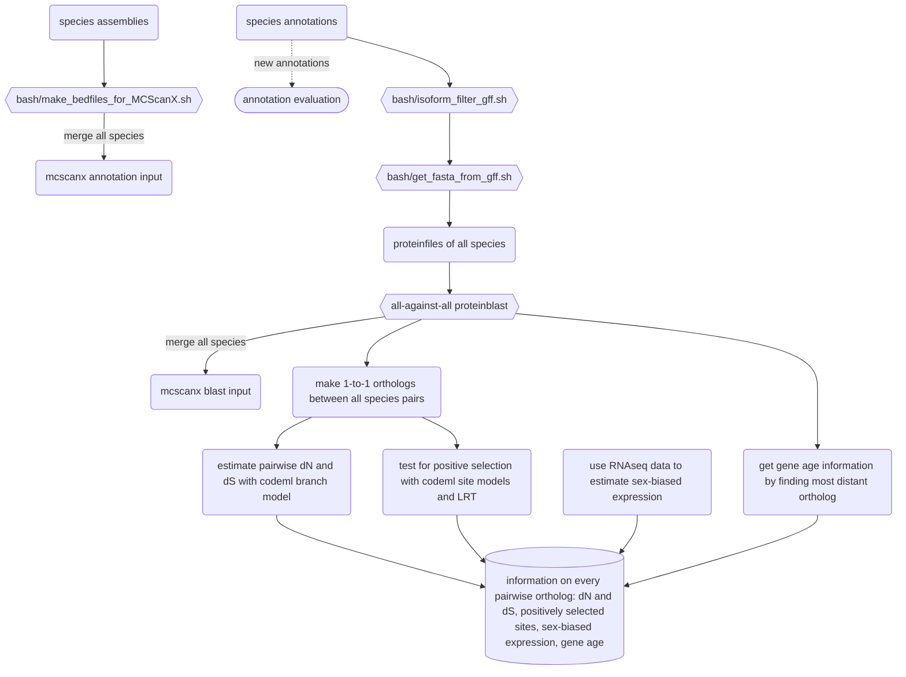

# Chapter III: SlowX/FastX in coleoptera


## Workflow

<details>


```mermaid
graph TD;
    species_Ass(species assemblies);
    species_Ass --> simplified_bed{{bash/make_bedfiles_for_MCScanX.sh}};
    simplified_bed -- merge all species --> mcscanx_bed(mcscanx annotation input);
    
    species_Ann(species annotations);
    species_Ann -. new annotations .-> BUSCO([annotation evaluation]);
    species_Ann --> is_filter{{bash/isoform_filter_gff.sh}};
    is_filter --> get_prot{{bash/get_fasta_from_gff.sh}};
    get_prot --> protfiles(proteinfiles of all species);
    protfiles --> blast{{all-against-all proteinblast}};
    blast -- merge all species --> mcscanx_blast(mcscanx blast input);
    
    blast --> dNdS_groups(make 1-to-1 orthologs between all species pairs);
    blast --> gene_age(get gene age information by finding most distant ortholog);

    dNdS_groups --> basicFastX(estimate pairwise dN and dS with codeml branch model);
    dNdS_groups --> posSel(test for positive selection with codeml site models and LRT);
    sexbias(use RNAseq data to estimate sex-biased expression)

    basicFastX --> summary[(information on every pairwise ortholog: dN and dS, positively selected sites, sex-biased expression, gene age)]
    posSel --> summary
    sexbias --> summary
    gene_age --> summary

```   


### sex chromosome identification

SATC R package

* **Bruchids**
  * *C. maculatus:* from Kaufmann et al.: 
    ```python
    { X : ['utg000057l_1','utg000114l_1','utg000139l_1','utg000191l_1','utg000326l_1','utg000359l_1','utg000532l_1','utg000602l_1'],
      Y : ['utg000322l_1','utg 000312c_1','utg 000610l_1','utg 001235l_1']}
    ## superscaffolded
    { X : ['scaffold_10','scaffold_14','scaffold_23','scaffold_31','scaffold_34','scaffold_83'],
      Y : ['scaffold_26','scaffold_48','scaffold_103','scaffold_112','scaffold_164']}
    ``` 
  
  * *C. chinensis:*
    identified by me, but the assembly is very fragmented so there is a lot of contigs.

    ```python
    { X : ["1211_quiver","1844_quiver","854_quiver","5741_quiver","2866_quiver","658_quiver","1498_quiver","1455_quiver","2404_quiver","2935_quiver","1115_quiver","370_quiver","2273_quiver","1424_quiver","1865_quiver","767_quiver","2222_quiver","1525_quiver","5023_quiver","1925_quiver","1217_quiver","2328_quiver","2475_quiver","959_quiver","537_quiver","2776_quiver","325_quiver","2576_quiver","2336_quiver","988_quiver","2252_quiver","1388_quiver","1508_quiver","1712_quiver","1260_quiver","977_quiver","2202_quiver","2223_quiver","2397_quiver","693_quiver","1092_quiver","2189_quiver","1958_quiver","1355_quiver","2241_quiver","849_quiver","703_quiver","277_quiver","518_quiver","2589_quiver","1326_quiver","2962_quiver","2341_quiver","358_quiver","462_quiver","2786_quiver","1116_quiver","525_quiver","1358_quiver","5693_quiver","1429_quiver","1253_quiver","2372_quiver","326_quiver","474_quiver","777_quiver","955_quiver","1852_quiver","718_quiver","1024_quiver","1974_quiver","2295_quiver","2356_quiver","1484_quiver","1503_quiver","3076_quiver","2091_quiver","1262_quiver","1109_quiver","1475_quiver","1695_quiver","1168_quiver","1386_quiver","2201_quiver","2320_quiver","1117_quiver","769_quiver","2050_quiver","1805_quiver","2692_quiver","411_quiver","851_quiver","5703_quiver","1585_quiver","824_quiver","1816_quiver","1370_quiver","2416_quiver","1814_quiver","1277_quiver","619_quiver","1750_quiver","2709_quiver","2664_quiver","1250_quiver","971_quiver","3020_quiver","310_quiver","1176_quiver","2510_quiver","1699_quiver","1256_quiver","1420_quiver","5727_quiver","413_quiver","1124_quiver","682_quiver","1000_quiver","1313_quiver","5708_quiver","1556_quiver","274_quiver","1787_quiver","1137_quiver","360_quiver","1469_quiver","1853_quiver","2380_quiver","1239_quiver","993_quiver","791_quiver","2540_quiver","1510_quiver","868_quiver","505_quiver","1212_quiver","376_quiver","1564_quiver","1836_quiver","1670_quiver","500_quiver","2099_quiver","353_quiver","1042_quiver","419_quiver","1314_quiver","1339_quiver","1470_quiver","1576_quiver","1717_quiver","5692_quiver","2157_quiver","700_quiver","1284_quiver","1694_quiver","2306_quiver","2712_quiver","182_quiver","1973_quiver","882_quiver","2363_quiver","2482_quiver","1640_quiver","1913_quiver","2323_quiver","1240_quiver","161_quiver","1649_quiver","1164_quiver","1054_quiver","1096_quiver","313_quiver","1815_quiver","1831_quiver","1349_quiver","151_quiver","1478_quiver","1523_quiver","1888_quiver","739_quiver","1322_quiver","2338_quiver","1798_quiver","1391_quiver","1530_quiver","1519_quiver","1651_quiver","1105_quiver","509_quiver","1308_quiver","1833_quiver","1914_quiver","1741_quiver","1080_quiver","2292_quiver","2364_quiver","643_quiver","5745_quiver","1920_quiver","1725_quiver","125_quiver","1086_quiver","2552_quiver","5749_quiver","2120_quiver","2964_quiver","5722_quiver","2045_quiver","2422_quiver","593_quiver","1496_quiver","1772_quiver","799_quiver","2690_quiver","414_quiver","1531_quiver","1443_quiver","1408_quiver","1688_quiver","1371_quiver","1501_quiver","3090_quiver","1025_quiver","5698_quiver","347_quiver","1435_quiver","476_quiver","1883_quiver","2820_quiver","5728_quiver","342_quiver","1972_quiver","1826_quiver","968_quiver","2037_quiver","1723_quiver","252_quiver","1863_quiver","2983_quiver","1947_quiver","1430_quiver","1612_quiver","1701_quiver","839_quiver","613_quiver","1979_quiver","1584_quiver","2024_quiver","1486_quiver","1097_quiver"],
      Y : ["850_quiver","949_quiver","1088_quiver","1125_quiver","1159_quiver","1134_quiver","1224_quiver","1369_quiver","1410_quiver","1568_quiver","1577_quiver","1619_quiver","1634_quiver","1646_quiver","1652_quiver","1665_quiver","1681_quiver","1697_quiver","1722_quiver","1766_quiver","1783_quiver","1891_quiver","1937_quiver","1963_quiver","1790_quiver","1997_quiver","2073_quiver","2113_quiver","2163_quiver","2166_quiver","5705_quiver","2245_quiver","2259_quiver","2260_quiver","2334_quiver","2340_quiver","2382_quiver","2443_quiver","2511_quiver","2534_quiver","2573_quiver","2597_quiver","2651_quiver","2707_quiver","2766_quiver","2773_quiver","2791_quiver","2830_quiver","2875_quiver","3022_quiver","3070_quiver","3074_quiver","3075_quiver","3078_quiver"]}
    ```
  * *B. siliquastri* identified by the DTOL project with the assembly
    ```python
    { X : ['X'],
      Y : ['Y']}
    ``` 
  * *A. obtectus* Identified by me and Göran's project about it
    ```python
    #### TODO double check these contig IDs
    { X : ["CAVLJG010000002.1","CAVLJG010003236.1","CAVLJG010003544.1","CAVLJG010000099.1","CAVLJG010000155.1","CAVLJG010000244.1","CAVLJG010000377.1","CAVLJG010000488.1",],
      Y : ["CAVLJG010000343.1","CAVLJG010002896.1","CAVLJG010000233.1","CAVLJG010000566.1","CAVLJG010000588.1",]}
    ``` 


* **Tribolium**
  * [Tribolium castaneum](https://www.ncbi.nlm.nih.gov/datasets/genome/GCF_031307605.1/)
  ```python
  { X : ['NC_087403.1'], # I think based on synteny, not identified on the NCBI
    Y : ['unidentified']}
  ```
  * [Tribolium freemani](https://www.ncbi.nlm.nih.gov/datasets/genome/GCA_022388455.1/)
  ```python
  { X : ['CM039461.1'], # identified as linkage group X (LGX) on the NCBI
    Y : ['unidentified']}
  ```

* **Coccinella**
  * [Coccinella septempunctata](https://www.ncbi.nlm.nih.gov/datasets/genome/GCF_907165205.1/)
  ```python
  { X : ['NC_058198.1'],
    Y : ['unidentified']}
  ```
  * [Coccinella magnifica](https://www.ncbi.nlm.nih.gov/datasets/genome/GCA_965644565.1/)
  ```python
  { X : ['OZ286750.1'],
    Y : ['unidentified']}
  ```
