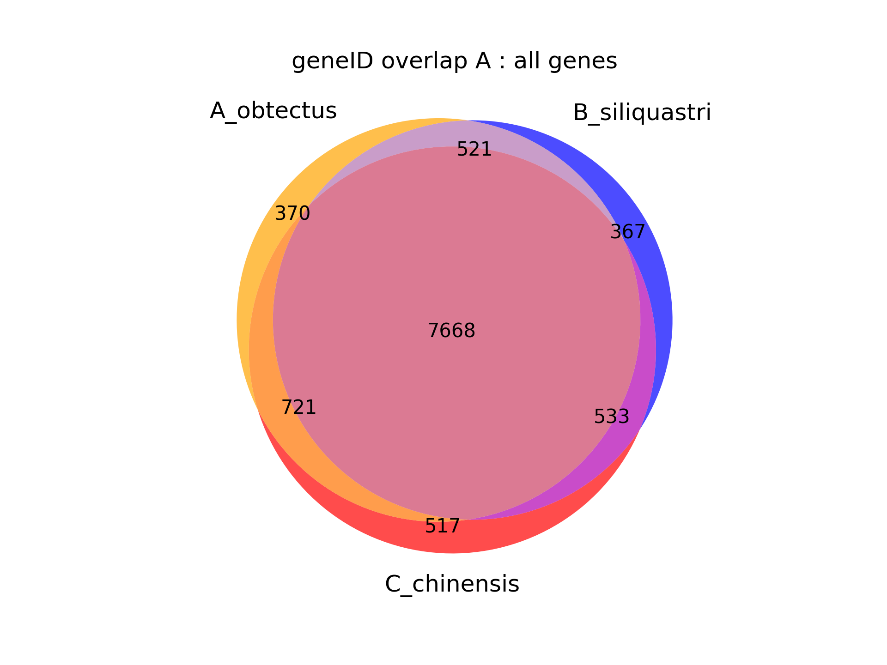
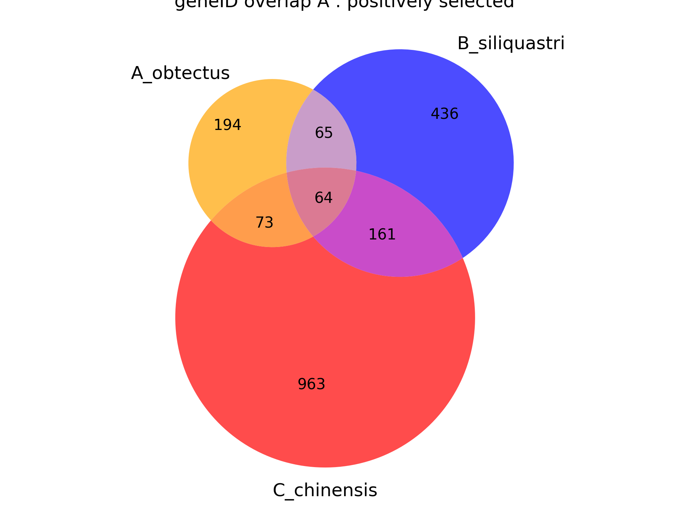
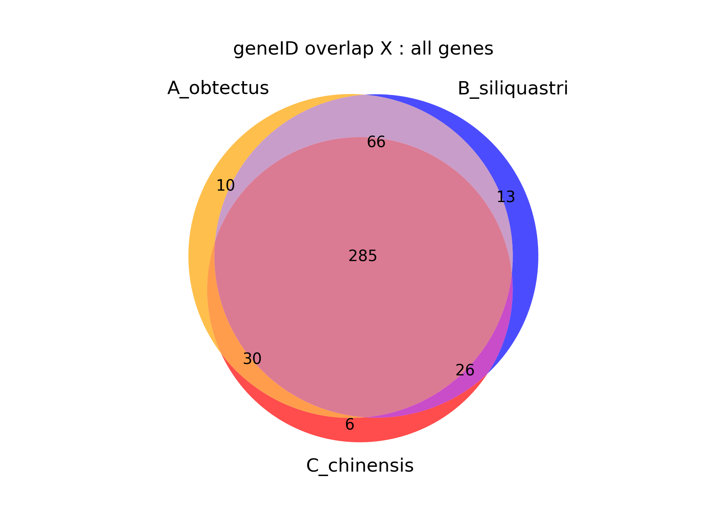
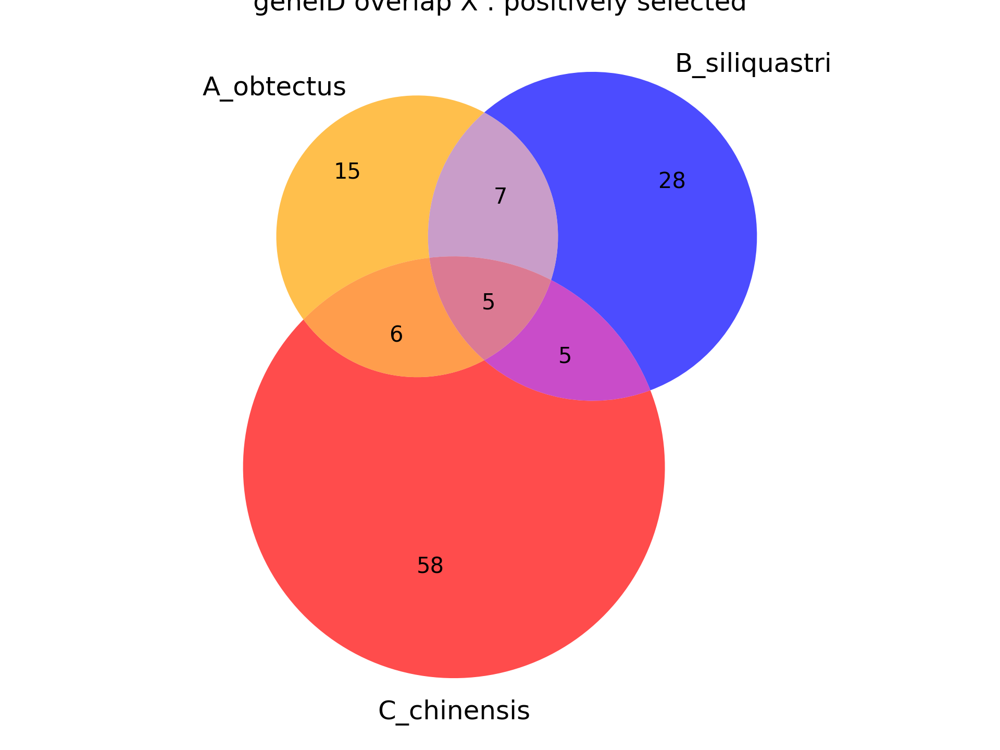

# Functional annotation of C. maculatus for GO-term enrichment

All data is here: `/proj/naiss2023-6-65/Milena/chapter3/Cmac_func_annot`. I will use a lot of Ingo's work for the waterstriders since he did a really nice method evaluation and comparison for EggNOg mapper, BLAST+ and interproscan.

Since InterProScan is not available on pelle yet, I will just use eggnogmapper (diamond) since that seems to be the best and fastest option for right now. for future analyses (chapter 4) I might go back to this, and run interproscan as well and then merge them (there is just an agat module that can do this: `agat_sp_manage_functional_annotation.pl`)

## Eggnog mapper

the Eggnogmapper databases are not available on pelle (or I can't find them?). So I tried to download them with `download_eggnog_data.py` as the documentation suggests, but these urls are outdated. I use the error messages from the script and some googling to try to find current urls to download from:

```bash
wget -nH --user-agent=Mozilla/5.0 --relative --no-parent --reject "index.html*" --cut-dirs=4 -e robots=off -O eggnog.db.gz http://eggnog5.embl.de/download/emapperdb-5.0.2/eggnog.db.gz && echo Decompressing... && gunzip eggnog.db.gz
wget -nH --user-agent=Mozilla/5.0 --relative --no-parent --reject "index.html*" --cut-dirs=4 -e robots=off -O eggnog.taxa.tar.gz http://eggnog5.embl.de/download/emapperdb-5.0.2/eggnog.taxa.tar.gz && echo Decompressing... && tar -zxf eggnog.taxa.tar.gz && rm eggnog.taxa.tar.gz
wget -nH --user-agent=Mozilla/5.0 --relative --no-parent --reject "index.html*" --cut-dirs=4 -e robots=off -O eggnog_proteins.dmnd.gz http://eggnog5.embl.de/download/emapperdb-5.0.2/eggnog_proteins.dmnd.gz && echo Decompressing... && gunzip eggnog_proteins.dmnd.gz
```

the decorating gff flag did not work, the output was empty except the gff3 header, but the normal annotation file is still there.

The GO annotation is here: `/proj/naiss2023-6-65/Milena/chapter3/Cmac_func_annot/eggnog/C_mac_eggnog_diamond.emapper.annotations`

# GO analysis

## gene set selection

The overlap is pretty good for all X or all A genes, but not great for the positively selected genes, I will therefore make one enrichment analysis for each species comparing positively selected genes to the background set within X and within A, and one comparing the background set between X and A:

* within X and A separately:
  * for each of the three species:
    * enrichment of positively selected genes compared to the background of all genes in this category
* between X and A
  * enrichment of X-linked (union between all species lists) background genes compared to all 

<p float="left">
  
  
</p>
<p float="left">
  
  
</p>
