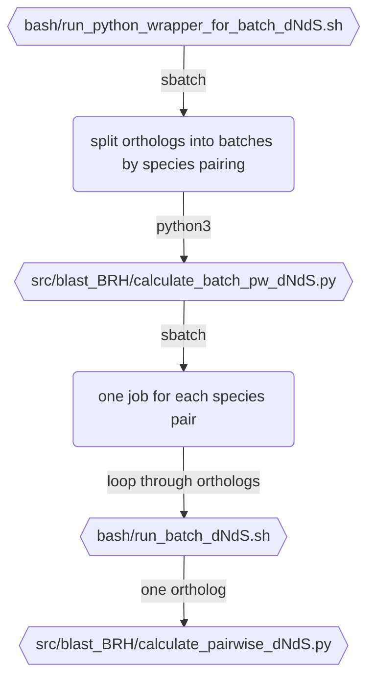

### running the batch mode for `calcualte_pairwise_dNdS.py`

This is a bit complicated, because I am splitting it so that each comparison is it's own job on the cluster. I don't want to run separate jobs for each ortholog because the HPC won't like that, and running all in the same job would take forever. hope the diagram makes it clear. Tne files contain checks to detect whether they are run on my work iMac or pelle, but no other options.




!! run from the top directory of the results. this makes a nested directory structure that's like:

```
├── B_siliquastri_D_carinulata_pairwise_dNdS
│   ├── B_siliquastri_D_carinulata_X-linked_ortholog_0_dNdS
│   │   ├── 2NG.dN
│   │   ├── 2NG.dNdS
│   │   ├── 2NG.dS
│   │   ├── 2NG.t
│   │   ├── 4fold.nuc
│   │   ├── codeml.ctl
│   │   ├── codeml.log
│   │   ├── codeml.out
│   │   ├── lnf
│   │   ├── prot_aln.fasta
│   │   ├── prot_aln.fasta.paml
│   │   ├── protein_sequences.faa
│   │   ├── rst
│   │   ├── rst1
│   │   ├── rub
│   │   ├── tree.tre
│   │   └── tree_10chr_leafnames.tre
│   └── ...
├── B_siliquastri_D_sublineata_pairwise_dNdS
│   ├── B_siliquastri_D_sublineata_X-linked_ortholog_0_dNdS
│   └── ...
└── C_chinensis_C_maculatus_pairwise_dNdS
    ├── C_chinensis_C_maculatus_X-linked_ortholog_105_dNdS
    └── ...

```